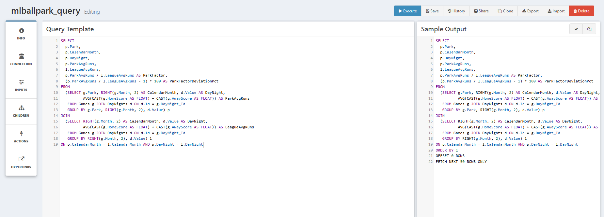
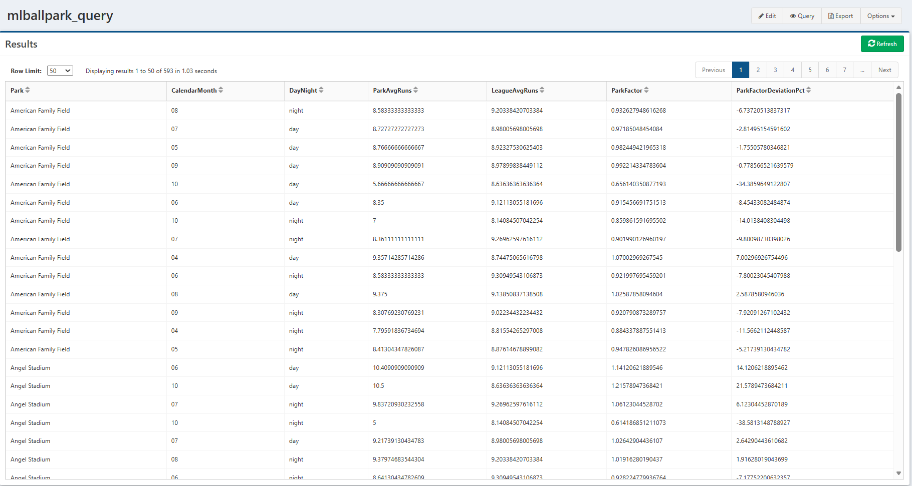

# Calculating Park Factors in a QueryView

QueryViews provide querying and exploration of data stored in a database in an interactive web-based environment. In this tutorial, we will continue the series using the game data [loaded into a DataPortal](2-DataPortal.md), computing the park factor itself in SQL and reviewing the result as a grid.

The calculation is a ratio of two averages. For each park, calendar month and time of day, we take that park's average runs per game, and divide it by the league's average runs for the same month and time of day. Pooling every July together, rather than each individual July, keeps the sample large enough to be meaningful.

## Accessing the Database with a Key

To access any database, you need log-in credentials. When we created the DataPortal, this does not create credentials, so you will need to get in touch with your Composable administrator/DBA to create credentials to access the `MLBParkFactorModel` database before continuing. Note that the database is named after the DataPortal with a `Model` suffix, and not a name of your choosing.

With your database credentials, you can store them securely in Composable Key Vault as a [Key](../../Keys/01.Overview.md).

Go to the `Create New` Keys page, and select `Database Connection Settings` as the `Property Type`.

Then enter the following values into the fields, including the credentials that were set up. Because this is the local Composable instance the `Host` is `.`. If accessing a database on another server, the host is the IP address of the server.

| Field                | Entry                                                        |
| -------------------- | ------------------------------------------------------------ |
| Name                 | mlballpark                                                   |
| Description          | <Optional description of the key\>                           |
| Host                 | .                                                            |
| Database             | MLBParkFactorModel (name of the DataPortal Database)         |
| Username             | <Your database username\>                                    |
| Password             | <Your database password\>                                    |
| Connection parameter | TrustServerCertificate = yes                                 |

The connection parameter is required, not optional. ODBC Driver 18 turns encryption on by default, so without `TrustServerCertificate=yes` the connection fails with *"SSL Provider: The certificate chain was issued by an authority that is not trusted."*

The login also needs read access to this particular database. The public login that Composable sets up at install time is granted rights on the Composable databases only, and a DataPortal database is created later, at runtime, so it is not covered. Your DBA can grant it with two statements.

```sql
USE MLBParkFactorModel;
CREATE USER CompAnalyticsPublicUser FOR LOGIN CompAnalyticsPublicUser;
ALTER ROLE db_datareader ADD MEMBER CompAnalyticsPublicUser;
```

Save the Key, and now we can get started on creating a QueryView.

## Querying Park Factors in a QueryView

### Create a New QueryView

Now go to the QueryView menu, and select `Create New`. Start with the `Info` button on the left side panel, and enter `mlballpark_query` as the `Name`. Then move to the `Connection` panel, click the `Select Connection` button, and choose the `mlballpark` Key we just created.

Now is a good time to hit the `Save` button in the top right. You cannot run a QueryView if it has not been saved.

### Writing a Query

Our data was loaded into the `Games` table. Going back to the DataPortal tutorial, we named the container `Games`, and the database creation process of a DataPortal will pluralize names, which for this container leaves the name unchanged.

Recall that `DayNight` is a picklist, so the games table stores a `DayNight_Id` and the readable value lives in a `DayNights` lookup table. That is why the query joins the two. `RIGHT(g.Month, 2)` pulls the calendar month out of the `YYYY-MM` string, so that all eleven Julys are pooled together.

```sql
SELECT
  p.Park,
  p.CalendarMonth,
  p.DayNight,
  p.ParkAvgRuns,
  l.LeagueAvgRuns,
  p.ParkAvgRuns / l.LeagueAvgRuns AS ParkFactor,
  (p.ParkAvgRuns / l.LeagueAvgRuns - 1) * 100 AS ParkFactorDeviationPct
FROM
  (SELECT g.Park, RIGHT(g.Month, 2) AS CalendarMonth, d.Value AS DayNight,
          AVG(CAST(g.HomeScore AS FLOAT) + CAST(g.AwayScore AS FLOAT)) AS ParkAvgRuns
   FROM Games g JOIN DayNights d ON d.Id = g.DayNight_Id
   GROUP BY g.Park, RIGHT(g.Month, 2), d.Value) p
JOIN
  (SELECT RIGHT(g.Month, 2) AS CalendarMonth, d.Value AS DayNight,
          AVG(CAST(g.HomeScore AS FLOAT) + CAST(g.AwayScore AS FLOAT)) AS LeagueAvgRuns
   FROM Games g JOIN DayNights d ON d.Id = g.DayNight_Id
   GROUP BY RIGHT(g.Month, 2), d.Value) l
ON p.CalendarMonth = l.CalendarMonth AND p.DayNight = l.DayNight
```

Paste the query into the `Query Template` pane on the left. As we're typing, the `Sample Output` pane on the right is generating what the final query will look like, with `ORDER BY 1`, `OFFSET 0 ROWS` and `FETCH NEXT 50 ROWS ONLY` appended by the [paging](../../QueryViews/Paging.md) wrapper.



The left rail, `INFO`, `CONNECTION`, `INPUTS`, `CHILDREN`, `ACTIONS`, `HYPERLINKS`, is where the connection key is selected, under `CONNECTION`.

!!! note
	Leave the `ORDER BY` out of the query itself and use the QueryView's own Order configuration on the `Info` panel instead. The paging wrapper adds its own ordering, and an inner `ORDER BY` collides with it.

Press the Execute button and take a look at the results. Once the sync DataFlow has loaded the portal, this returns 593 rows across seven columns, one per park, calendar month and time of day combination. The header reads *Displaying results 1 to 50 of 593*.



A `ParkFactor` above 1 is a hitter-friendly park-month, and below 1 is pitcher-friendly. `ParkFactorDeviationPct` states the same thing as a percentage away from the league average.

This is a good place to sanity check the pipeline against baseball common knowledge. Filter to Coors Field and the numbers should run high, and to a pitcher's park such as Oracle Park and they should run low.

## Next Steps

The QueryView is a grid, which is ideal for reporting and for exploring the data on your own. To make the same numbers readable at a glance, we chart them in a [WebApp](4-WebApp.md).

QueryViews can do considerably more than the single query we wrote here. [Inputs](../../QueryViews/Inputs.md) make the results interactive, [Hyperlinks](../../QueryViews/Hyperlinks.md) add links built from each row, and [Actions](../../QueryViews/Actions.md) connect results back to DataFlows.
