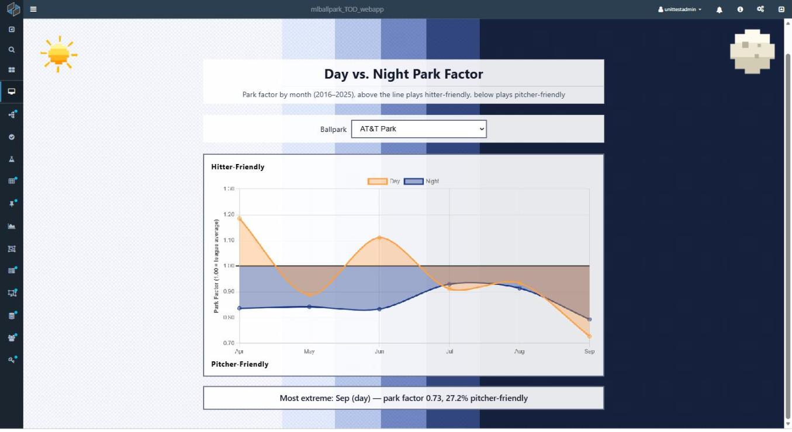
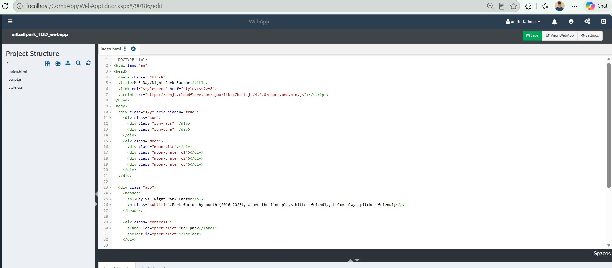

# Charting Park Factors in a WebApp

A [WebApp](../../WebApps/01.Overview.md) hosts your own HTML, JavaScript and CSS inside Composable, served from the platform and secured by the same permissions as every other resource. In this lab we build the page that reads the JSON from our API DataFlow and draws it.

The page fetches the JSON once, fills a ballpark dropdown from the distinct `Park` values, and draws two [Chart.js](https://www.chartjs.org/) series, day and night, both on the same axis and both expressed as park factor. Above the center line the park plays hitter-friendly, and below it plays pitcher-friendly. The axis fits itself to whichever park is selected, so that an extreme park is not drawn off the top of the chart.



At AT&T Park, night (blue) sits below 1.00 all season, while day (orange) swings from 1.19 in April down to 0.73 in September. Both series share one scale, where 1.00 is the league average for that month and time of day.

## Creating the WebApp

Go to the WebApp menu, select [Create New](../../WebApps/02.WebApp-Create-New.md), and name it `mlballpark_TOD_webapp`, with `index.html` as the entrypoint.

In the [editor](../../WebApps/03.WebApp-Editor.md), add three files under `Project Structure` on the left, `index.html`, `script.js` and `style.css`, and paste in the listings below. Each file opens in its own tab in the code pane.



`Project Structure` on the left lists the three files, and the code pane holds the open tab. `Save` and `View WebApp` sit in the upper right.

In `script.js`, set `API_URL` to the activation url of the API DataFlow from the first lab. Then press `Save`, followed by `View WebApp` to open the page.

!!! note
	The `?v=` query string on the stylesheet and script tags is deliberate. Browsers cache WebApp resources aggressively, so bump that number whenever you edit `script.js` or `style.css`, or you will be looking at yesterday's file while wondering why your change did nothing.

## The Page Markup

The markup is deliberately thin: a decorative sky with a pixel sun and moon, a dropdown, a canvas for Chart.js with a zone label above and below it, and a callout beneath for the most extreme month.

```html
<!DOCTYPE html>
<html lang="en">
<head>
  <meta charset="UTF-8">
  <title>MLB Day/Night Park Factor</title>
  <link rel="stylesheet" href="style.css?v=1">
  <script src="https://cdnjs.cloudflare.com/ajax/libs/Chart.js/4.4.0/chart.umd.min.js"></script>
</head>
<body>
  <div class="sky" aria-hidden="true">
    <div class="sun">
      <div class="sun-rays"></div>
      <div class="sun-core"></div>
    </div>
    <div class="moon">
      <div class="moon-disc"></div>
      <div class="moon-crater c1"></div>
      <div class="moon-crater c2"></div>
      <div class="moon-crater c3"></div>
    </div>
  </div>

  <div class="app">
    <header>
      <h1>Day vs. Night Park Factor</h1>
      <p class="subtitle">Park factor by month (2016–2025), above the line plays hitter-friendly, below plays pitcher-friendly</p>
    </header>

    <div class="controls">
      <label for="parkSelect">Ballpark</label>
      <select id="parkSelect"></select>
    </div>

    <div class="chart-zone">
      <div class="zone-label">Hitter-Friendly</div>
      <canvas id="parkChart"></canvas>
      <div class="zone-label">Pitcher-Friendly</div>
    </div>

    <div id="callout" class="callout"></div>
  </div>

  <script src="script.js?v=1"></script>
</body>
</html>
```

## The Page Script

The script fetches the JSON, builds the dropdown, and redraws the chart whenever the selection changes. Both series are plotted on the same axis, without inverting one against the other, so that hitter-friendly is above the line for day and night alike. The axis bound is computed from the data, rounded up to the nearest 5%, with a floor of 10%, which is what keeps Coors Field on the page.

Note also that the callout filters to the months the chart actually plots. October rows exist in the data, and would otherwise win "most extreme" while having no point on the canvas.

```javascript
const API_URL = "/CompApp/services/WebActivationService.svc/Activate?appId=89113"; // your Section 1.3 DataFlow

const MONTH_LABELS = { "04": "Apr", "05": "May", "06": "Jun", "07": "Jul", "08": "Aug", "09": "Sep" };
const MONTH_ORDER = ["04", "05", "06", "07", "08", "09"];

let allRows = [];
let chart = null;

async function loadData() {
  let json;
  try {
    const res = await fetch(API_URL);
    if (!res.ok) {
      throw new Error(`${res.status} ${res.statusText}`);
    }
    json = await res.json();
  } catch (err) {
    document.getElementById("callout").textContent =
      `Could not load park factor data: ${err.message}`;
    return;
  }
  allRows = json.Rows || [];

  populateParkSelector();
  renderChart(document.getElementById("parkSelect").value);
}

function populateParkSelector() {
  const parks = [...new Set(allRows.map(r => r.Park))].sort();
  const select = document.getElementById("parkSelect");
  select.innerHTML = parks.map(p => `<option value="${p}">${p}</option>`).join("");
  select.addEventListener("change", e => renderChart(e.target.value));
}

function renderChart(park) {
  const rows = allRows.filter(r => r.Park === park);

  const dayData = MONTH_ORDER.map(m => {
    const row = rows.find(r => r.CalendarMonth === m && r.DayNight === "day");
    return row ? row.ParkFactorDeviationPct : 0;
  });

  const nightData = MONTH_ORDER.map(m => {
    const row = rows.find(r => r.CalendarMonth === m && r.DayNight === "night");
    return row ? row.ParkFactorDeviationPct : 0;
  });

  // a fixed +/-15 clipped real parks (AT&T Park runs to -27% in September), so scale to the data
  const spread = Math.max(10, ...dayData.concat(nightData).map(Math.abs));
  const bound = Math.ceil(spread / 5) * 5;

  const ctx = document.getElementById("parkChart").getContext("2d");
  if (chart) chart.destroy();

  chart = new Chart(ctx, {
    type: "line",
    data: {
      labels: MONTH_ORDER.map(m => MONTH_LABELS[m]),
      datasets: [
        {
          label: "Day",
          data: dayData,
          borderColor: "#ff9f43",
          backgroundColor: "rgba(255, 159, 67, 0.35)",
          fill: "origin",
          tension: 0.3,
          pointRadius: 4
        },
        {
          label: "Night",
          data: nightData,
          borderColor: "#1e3a8a",
          backgroundColor: "rgba(30, 58, 138, 0.4)",
          fill: "origin",
          tension: 0.3,
          pointRadius: 4
        }
      ]
    },
    options: {
      responsive: true,
      aspectRatio: 2.1,
      scales: {
        y: {
          min: -bound,
          max: bound,
          grid: {
            color: ctx => ctx.tick.value === 0 ? "#333" : "#ddd",
            lineWidth: ctx => ctx.tick.value === 0 ? 2 : 1
          },
          ticks: {
            // series carry % deviation; the axis is quoted as the park factor it represents
            callback: v => (1 + v / 100).toFixed(2)
          },
          title: {
            display: true,
            text: "Park Factor (1.00 = league average)",
            font: { weight: "600" }
          }
        }
      },
      plugins: {
        tooltip: {
          callbacks: {
            label: ctx => {
              const dsLabel = ctx.dataset.label;
              const val = ctx.raw;
              const sign = val > 0 ? "+" : "";
              const parkFactor = 1 + val / 100;
              return `${dsLabel}: ${parkFactor.toFixed(2)} (${sign}${val.toFixed(1)}% vs league avg)`;
            }
          }
        }
      }
    }
  });

  renderCallout(rows);
}

function renderCallout(rows) {
  // only months the chart actually plots -- October rows exist in the data and would
  // otherwise win "most extreme" while having no label and no point on the canvas
  const charted = rows.filter(r => MONTH_ORDER.includes(r.CalendarMonth));
  if (!charted.length) return;
  const extreme = charted.reduce((a, b) => Math.abs(b.ParkFactorDeviationPct) > Math.abs(a.ParkFactorDeviationPct) ? b : a);
  const dir = extreme.ParkFactorDeviationPct > 0 ? "hitter-friendly" : "pitcher-friendly";
  document.getElementById("callout").textContent =
    `Most extreme: ${MONTH_LABELS[extreme.CalendarMonth]} (${extreme.DayNight}) — park factor ${extreme.ParkFactor.toFixed(2)}, ${Math.abs(extreme.ParkFactorDeviationPct).toFixed(1)}% ${dir}`;
}

loadData();
```

## The Page Styles

The stylesheet paints the pixel art sun and moon with `clip-path` and `repeating-conic-gradient`, animated in `steps()` so that the motion stays blocky rather than smooth, and splits the background vertically between the day and night halves of the page.

```css
:root {
  --day-color: #ff9f43;
  --night-color: #1e3a8a;
  --panel: rgba(255, 255, 255, 0.9);
  --ink: #14182b;
  --pixel: 8px;
}

* { box-sizing: border-box; }

body {
  margin: 0;
  font-family: 'Segoe UI', system-ui, sans-serif;
  color: var(--ink);
  min-height: 100vh;
  image-rendering: pixelated;
  /* hard-stop bands instead of a blend: the split reads as blocky columns, not a gradient */
  background:
    linear-gradient(to right,
      #f7f9ff 0 34%,
      #e4ecff 34% 41%,
      #b9c9ee 41% 47%,
      #7288c4 47% 53%,
      #33477f 53% 60%,
      #16213e 60% 100%);
  background-attachment: fixed;
}

/* checkerboard texture: gives every band a visible pixel grain */
body::before {
  content: "";
  position: fixed;
  inset: 0;
  z-index: -1;
  pointer-events: none;
  background-image: repeating-conic-gradient(rgba(0,0,0,0) 0 25%, rgba(0,0,0,0.035) 0 50%);
  background-size: var(--pixel) var(--pixel);
}

/* ---------- sky decorations ---------- */

.sky { position: fixed; inset: 0; pointer-events: none; z-index: 0; }

.sun {
  position: absolute;
  top: 20px;
  left: 20px;
  width: 112px;
  height: 112px;
}

.sun-rays {
  position: absolute;
  inset: 0;
  background: repeating-conic-gradient(
    from 0deg,
    #ffb703 0deg 7deg,
    rgba(255, 183, 3, 0) 7deg 45deg);
  /* ring mask so the rays sit outside the core, in hard steps */
  -webkit-mask-image: radial-gradient(circle, transparent 0 33%, #000 33% 50%, transparent 50%);
  mask-image: radial-gradient(circle, transparent 0 33%, #000 33% 50%, transparent 50%);
  animation: ray-spin 8s steps(8) infinite;
}

.sun-core {
  position: absolute;
  inset: 30%;
  background:
    linear-gradient(to bottom,
      #ffe08a 0 25%,
      #ffcb47 25% 55%,
      #ffa41b 55% 80%,
      #f08a00 80% 100%);
  /* stepped polygon: a circle drawn out of square pixels */
  clip-path: polygon(
    33% 0, 67% 0, 67% 11%, 89% 11%, 89% 33%,
    100% 33%, 100% 67%, 89% 67%, 89% 89%, 67% 89%,
    67% 100%, 33% 100%, 33% 89%, 11% 89%, 11% 67%,
    0 67%, 0 33%, 11% 33%, 11% 11%, 33% 11%);
  animation: sun-pulse 2.4s steps(2) infinite alternate;
}

.moon {
  position: absolute;
  top: 20px;
  right: 20px;
  width: 96px;
  height: 96px;
  animation: moon-bob 6s steps(4) infinite alternate;
}

.moon-disc {
  position: absolute;
  inset: 0;
  box-shadow: 0 0 24px 6px rgba(226, 232, 255, 0.25);
  background:
    linear-gradient(to bottom,
      #fdfbef 0 30%,
      #ece7d2 30% 62%,
      #d2ccb4 62% 100%);
  clip-path: polygon(
    33% 0, 67% 0, 67% 11%, 89% 11%, 89% 33%,
    100% 33%, 100% 67%, 89% 67%, 89% 89%, 67% 89%,
    67% 100%, 33% 100%, 33% 89%, 11% 89%, 11% 67%,
    0 67%, 0 33%, 11% 33%, 11% 11%, 33% 11%);
  animation: moon-glow 3.6s steps(2) infinite alternate;
}

.moon-crater {
  position: absolute;
  background: #b9b199;
}

.moon-crater.c1 { width: 14px; height: 14px; top: 28%; left: 27%; }
.moon-crater.c2 { width: 9px;  height: 9px;  top: 56%; left: 55%; }
.moon-crater.c3 { width: 7px;  height: 7px;  top: 33%; left: 62%; }

@keyframes ray-spin { to { transform: rotate(360deg); } }
@keyframes sun-pulse { to { filter: brightness(1.18); } }
@keyframes moon-bob { to { transform: translateY(10px); } }
@keyframes moon-glow { to { filter: brightness(1.12) drop-shadow(0 0 6px rgba(226, 232, 255, 0.45)); } }

@media (prefers-reduced-motion: reduce) {
  .sun-rays, .sun-core, .moon, .moon-disc { animation: none; }
}

/* ---------- content ---------- */

.app {
  position: relative;
  z-index: 1;
  max-width: 900px;
  margin: 0 auto;
  padding: 150px 20px 40px;
}

header h1 {
  margin: 0;
  font-size: 1.8rem;
  text-align: center;
  background: var(--panel);
  padding: 10px;
}

.subtitle {
  text-align: center;
  color: #333c56;
  margin: 0;
  padding: 6px 10px 10px;
  background: var(--panel);
}

.controls {
  display: flex;
  justify-content: center;
  align-items: center;
  gap: 10px;
  margin: 24px 0;
  padding: 10px;
  background: var(--panel);
}

#parkSelect {
  padding: 8px 14px;
  border: 2px solid #47506e;
  border-radius: 0;
  font-size: 1rem;
  background: #fff;
}

.chart-zone {
  position: relative;
  display: flex;
  flex-direction: column;
  gap: 6px;
  background: var(--panel);
  padding: 16px;
  border: 2px solid #47506e;
}

canvas { position: relative; z-index: 1; }

/* in flow rather than absolute: an overlaid label collided with the x-axis month ticks */
.zone-label {
  font-size: 0.95rem;
  font-weight: 700;
  letter-spacing: 0.04em;
  color: #000;
}

.callout {
  margin-top: 20px;
  text-align: center;
  font-size: 1.1rem;
  font-weight: 500;
  padding: 12px;
  background: var(--panel);
  border: 2px solid #47506e;
}
```


## Verifying the Whole Pipeline

Work back through the pipeline in order. Each check tells you which stage is at fault if the numbers are wrong.

- Run `mlballparksync` and confirm that `Counts` reports about 48,000 records inserted, and that `Errors` is empty.
- Open `mlballpark_query` and confirm 593 rows.
- Run `mlballpark_TOD_api` from the Designer and confirm that its `Web Send` output carries the same 593 rows and the seven expected column names.
- Open the WebApp, pick a ballpark, and confirm that the chart draws. Fenway Park, Coors Field and Oracle Park are good sanity checks, since their reputations should show up in the numbers.

If something is off, these are the usual causes.

| Symptom                                                                              | Cause                                                                                                              |
| ------------------------------------------------------------------------------------ | ------------------------------------------------------------------------------------------------------------------ |
| QueryView fails with *"The certificate chain was issued by an authority that is not trusted"* | The Key is missing `TrustServerCertificate=yes`. ODBC Driver 18 encrypts by default.                               |
| QueryView fails with *"Cannot open database ... requested by the login"*             | The login has no rights on the portal database. Run the grant from the QueryView lab.                              |
| QueryView fails with *"Login failed for user"*                                       | The Key names a database that does not exist. The portal's database is `<PortalName>Model`.                        |
| `Invalid column name 'DayNight'`                                                     | `DayNight` is a picklist. Join `DayNights` on `DayNight_Id` instead of selecting the column directly.               |
| The page loads but the chart is empty, and the console shows a `500`                 | The viewer lacks Execute permission on the API DataFlow.                                                           |
| An edit to `script.js` or `style.css` has no effect                                  | Cached resource. Bump the `?v=` query string and hard-reload.                                                      |
| The sync reports errors for every row                                                | A container field name does not match its source column. Compare the DataPortal field table against the `ColumnNames` in the first lab. |

## Next Steps

The pipeline is a complete round trip: a public API becomes stored records, stored records become a query, and the query becomes a page someone can actually read. Each piece is replaceable, so swapping the JSON paths and the portal fields makes the same skeleton serve any other API.

A few natural extensions to try on your own:

- Schedule the sync. Add a timer activation to `mlballparksync` so that the portal refreshes nightly during the season. Timer activation runs in the Composable Activation Service, so confirm that service is running before relying on it.
- Widen the window. `MONTH_ORDER` in `script.js` covers April through September. October games are in the portal but off the chart, so add `"10"` to include them, and expect noisy values from the small sample.
- Split by season rather than by month. The portal keeps `Season` on every row, so a year over year comparison for a single park is a small change to the aggregation.
