## What you'll learn ##

- How to store values centrally for shared, repeatable, access-controlled use
- How to connect to an API with a Composable DataFlow
- Spotlight: How to evaluate module choices for a given task
- How to review module output
- How to parameterize strings
- DYK: How to change connectors and add comments within a DataFlow

### Setup ###

In order to be hands-on with this Project Lab Series, you will need to take care of two account setups. But don't worry… they're both simple and free!

First, if you don't already have access to the platform, you can create a Composable cloud account (**[Account Registration](https://cloud.composableanalytics.com/Account/Register.aspx)**).  Once your registration is complete, you can login (**[Account Login](https://cloud.composableanalytics.com/Account/FormLogin.aspx)**).

Second, you will need to follow these **[nasdaq.com Getting Started](https://docs.data.nasdaq.com/docs/getting-started#getting-an-api-key)** instructions to create your own Nasdaq Data Link API Key.

## Store credentials in a Composable Key ##

Before we dive into the DataFlow that will connect to the NASDAQ API to pull data, let's safely store our newly-made API credential in a Composable Key (**[Keys - Overview](https://docs.composable.ai/en/latest/Keys/01.Overview/)**).

To begin, once logged in to Composable, we can go to the sidebar on the left of the screen, hover over the Key icon, and click Create New.

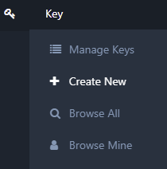

When presented with the New Key screen, under Property Type, select String because our NASDAQ API Key is an alphanumeric character string.

After you select String, the New Key screen adjusts to show the properties relevant to a String-based Key. You can fill in a Name, Description, and Value similar to the ones shown here – of course, filling in your _actual_ API key where it says "your key here".

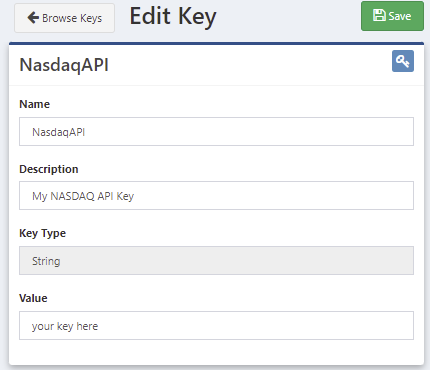

When ready, click the green Save button in the upper right.

This will create the Key and give it an ID. This Key can be used as a named reference within Composable without displaying the underlying credential. You can now return to the Keys management screen by clicking the Browse Keys button in the upper left.

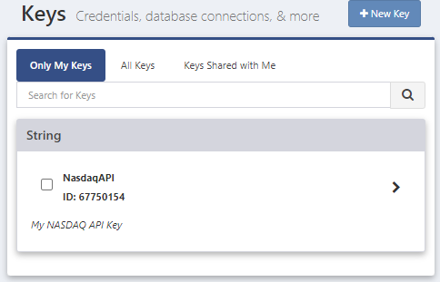

From the Edit Key screen, you can also Share, Clone and Delete keys. The Share functionality also lets you assign various access rights to those users or groups that you share with. For more, you can explore the Composable Docs for **[Sharing a Key](https://docs.composable.ai/en/latest/Keys/02.Using-Keys/#sharing-a-key)**.

OK. The first step in this lab is complete. Nice Job!

## Start a Composable DataFlow ##

Next, we'll want to use a Composable DataFlow to construct a workflow for our project.

Once again, we can go to the sidebar on the left of the screen. This time, we'll hover over the DataFlow icon and click Create New.

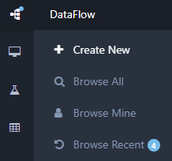

<small>(Eagle-eyed readers may notice that you have a different number, if any at all, next to Browse Recent at the bottom of this menu. This is simply a function of what your recent usage is and will be different depending on the person and day. Not to worry if yours doesn't match this screenshot.)</small>

Since the main task of this lab is to connect to a Web API, let's start with how to do that.

In order to winnow down the vast array of modules to choose from, in the Search bar (upper left, under Modules), enter "web".

(If you don't see the search bar, the Module Toolbox might be collapsed. If so, simply click on the vertical grey bar named Module Toolbox to expand it.)

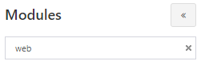

Looking at the filtered results under WebClient Data Sources (under Data Sources), we see a variety of choices.

If you want to follow an example of comparing modules to determine which best suits current needs, please check out the **[Composable Blog](https://blog.composable.ai/)** post **[Spotlight: Comparing Modules](https://blog.composable.ai/2022/09/06/spotlight-comparing-modules/)**.

If you want to cut to the chase now and maybe circle back to that Spotlight later, you can just drag a WebClient Robust module onto your DataFlow.

Before we move on to the next step in the lab, let's go over to the right side of the screen to Manage DataFlow. At the top, under Details, let's give this DataFlow a Name and a Description. We know it doesn't connect to the NASDAQ API yet, but that's what we'll do in the next step, so let's be aspirational here.

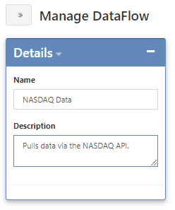

Now we can click the blue Save button (near Run). Each time you Save, you have the opportunity to document why you are making that particular save. You may enter a note here, if you wish, then click Save Changes.

From this point forward, you can be in charge of your own DataFlow saves and save-related comments.

Congratulations.  It's time to move on to our next lab step.

## Connect to Nasdaq Data Link ##

To use our WebClient Robust module, we need to pass a connection string to the Uri input that works for our desired API - in this case, Nasdaq Data Link.

The format that we will use for our NASDAQ data pull is:

> https://data.nasdaq.com/api/v3/datasets/WIKI/**<tickersymbol\>**/data.json? 
start\_date=**<year\>**-01-01& 
end\_date=**<year\>**-12-31& 
api\_key=**<apiauthkey\>**

Using an example of this formatting, to pull the daily stock price data for Apple from the year 2000, you could enter:

> https://data.nasdaq.com/api/v3/datasets/WIKI/**AAPL**/data.json? 
start\_date=**2000**-01-01& 
end\_date=**2000**-12-31& 
api\_key=**<your API key here\>**

<small>Note: I added line breaks to make this string more readable. Make sure to remove any vestigial spacing (before start…, end…, and api…) if you copy-and-paste.</small>

Since we are doing a read, not a write, we need to change the Method from POST to GET.

Once your module looks something like the screenshot below (with your API Key as well), you can click the green Run button at the top of the DataFlow.

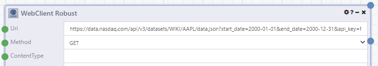

Once the run is complete, you can right-click on the second output and select View Results.

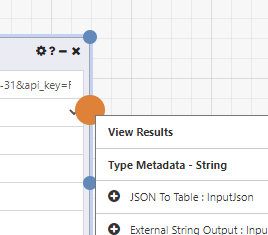

That will display a window that looks something like this (after expanding it):

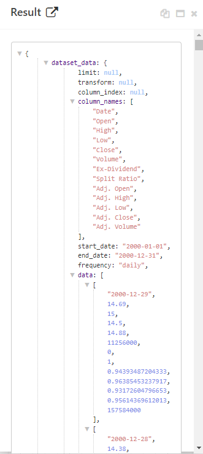

We can see that our result is JSON including column names, start and end dates, and daily stock data.

Great!  Our connection works. Now let's think of how we can improve it and make it more flexible to use.

## Parameterize our connection ##

Now that we have set up our connection, it's probable that we would want to use it for more than just the one example (Apple, 2000). That means that we would need to adjust the filter parameters in the API string.

Of course, we could just go into the Uri input and change the text, but that seems a) clunky and b) prone to editing errors.

Instead, let's parameterize the connection string for flexibility and simpler reuse. To figure out how we might do that, we can let Composable help us by leveraging the module suggestions that the platform provides.

Since it's the Uri input that we will want to change, we can go to the green dot next to Uri and right-click.

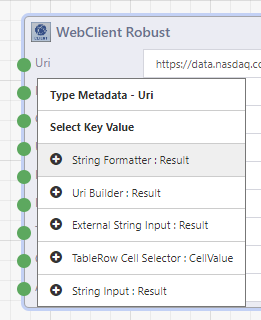

We can see a list of likely module candidates suggested as next steps. Depending on the use case, any of these options might work. To simplify our journey, let's pick the first item in the list: String Formatter.

We now see that Composable has added the selected module into our DataFlow and connected it to the input that we right-clicked on.

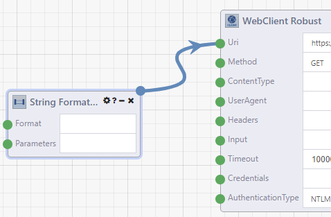

If we look at the module details (**?** icon) for String Formatter, we see two inputs (Format and Parameters) and an output of Result.

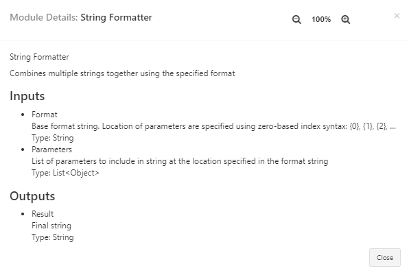

Format lets us templatize the string we want to use and Parameters feeds values into that template to create the Result's final string output.

We saw earlier that our format boils down to:

> https://data.nasdaq.com/api/v3/datasets/WIKI/**<tickersymbol\>**/data.json? 
start\_date=**<year\>**-01-01& 
end\_date=**<year\>**-12-31& 
api\_key=**<apiauthkey\>**

That gives us three parameters that we want to pass. One for the ticker, one for the year, and also our API key.

<small>(We could pull multi-year datasets if we made the start and end years different, or add even more flexibility by passing the whole start and end date strings, but let's keep this simple for now. Perhaps you'll be inspired to revisit this DataFlow after we're done to add more adjustments on your own.)</small>

That lets us set up our Format input template as:

> https://data.nasdaq.com/api/v3/datasets/WIKI/**{0}**/data.json?start\_date=**{1}**-01-01&end\_date=**{1}**-12-31&api\_key=**{2}**

We can place that in the Format input to get this:

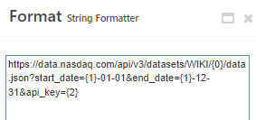

We know that our first parameter – the ticker symbol – is a String. When we right-click on the Parameters input, we see that String Input happens to be the first module suggested.

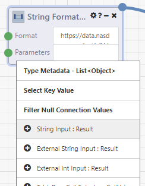

After we select String Input, our DataFlow looks something like this:

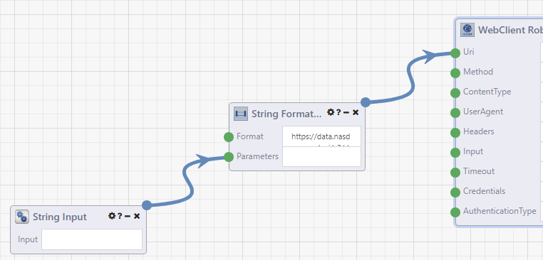

While our second parameter – year – might _seem_ like a number, we are not doing numeric things with it. We are passing it into a text string. So, that is also a String and we can once again right-click on the Parameters input and add another String Input.

At first, it may seem like nothing happened, but you may find that the second String Input module was added on top of the first. In that case, simply click-and-drag to move it to another location to reveal both.

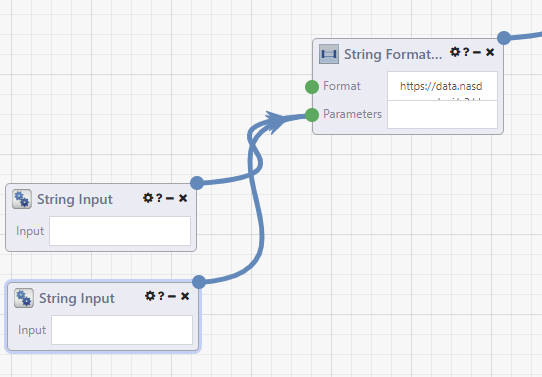

We saw from the module detail that the parameters are being used in a particular order. So how does anyone know in which order these two String Inputs will be used? If you hover over the Parameters input, you can see the connections are highlighted and each has a number.

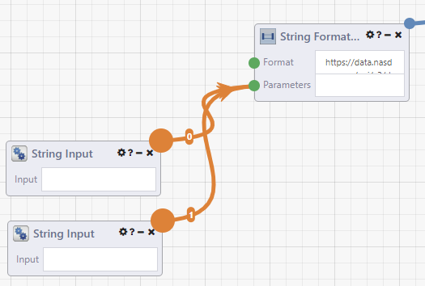

To keep ourselves organized, let's rename these two modules appropriately. If you double-click on the module title, you can edit it.

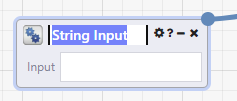

Let's rename the String Input numbered 0 as "Ticker" and rename the other to "Year". Now we have something that looks like this (I've dragged the modules closer together, and hovered over the Parameters input):

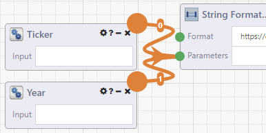

That order is assigned by the order in which the modules were connected. If you added the modules from the toolbox and connected them randomly, or deleted one and re-added/re-connected out of order, or assigned the new names to the wrong modules, not to worry. You can not only see the order by hovering over the input, but also _adjust_ the order if you shift+right-click on the input. That would give you a menu where the items can be dragged into the desired position.

In the image below, I have done a shift+right-click on the Parameters input and begun to drag Year upwards, as if I wanted to move it above Ticker. I don't _actually_ want to do that, because I have them in the desired order. I'm just showing you what it would look like, in case you ever need to use this cool mistake-eraser.

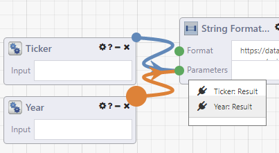

If you want to know what the original name was for a renamed module, you can hover over the module's icon (upper left) and it will display.

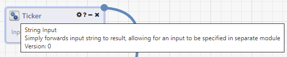

Moving on to the third parameter, we could add our API Key as a third String Input, but I'm a little squeamish about adding credentials, identifiers, account information and the like as raw, unhidden text anywhere. _Anywhere…_ So, I'm certainly not psyched about hard-coding my API Key as String Input. Nor would I recommend it.

What to do?

Well, remember our first step in this lab? We created a Composable Key to mask our API Key value. If we right-click on the Parameters input again, we see Key Loader (ID) further down the list.

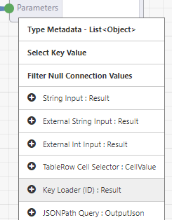

When we select that, we get a third module connected to our Parameters input.

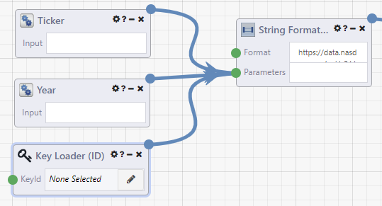

Now let's click on the pencil within the Key Loader's KeyId input. We are presented with a Keys to Load pop-up containing our NasdaqAPI name and String type.

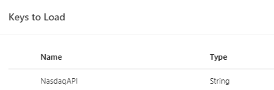

Click on the Key and click Select String

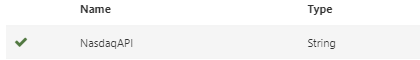

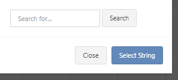

Now our DataFlow starts with:

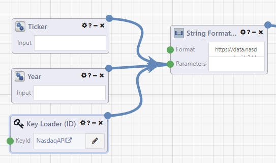

That gives us two flexible, easy-to-access inputs for picking our ticker symbol and year and attaches our API Key without directly exposing it.

Nice!

## Testing the pipeline ##

Heading into the home stretch…

It seems important to make sure that our new configuration not only gives us flexibility, but also gives us what we had before – the data.

Since we have now replaced the hard-coded API string with our String Formatter, we no longer need the Uri populated in our WebClient Robust Module. Let's clear that out.

Now, we need to test that the ticker, year, and key get properly placed into the string, which passes into the WebClient Robust Uri, which makes the correct API call. If we have set this up correctly, we should be able to enter the same parameters – AAPL and 2000, respectively – into our Ticker and Year inputs and get the same results as before.

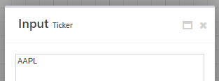

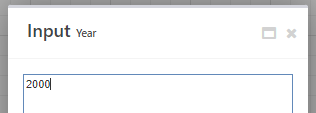

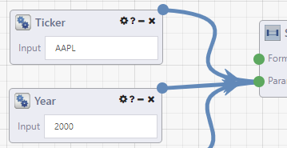

With that set up, let's go back to click the Run button.

You might briefly see dots moving down the various connectors to represent data moving down the pipelines.

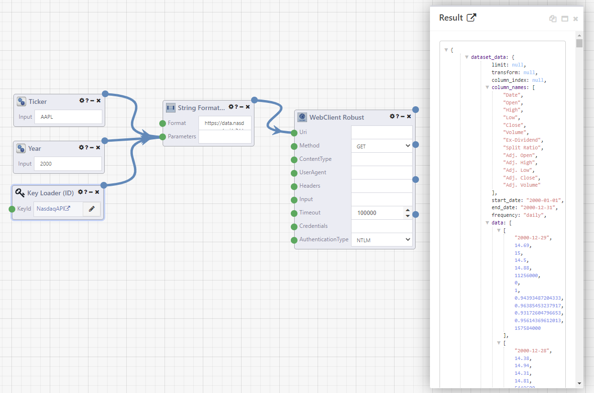

Success!

Even better, if we want to pull a different dataset, say Microsoft (MSFT) from 2002, we just switch the Ticker and Year values and Run again.

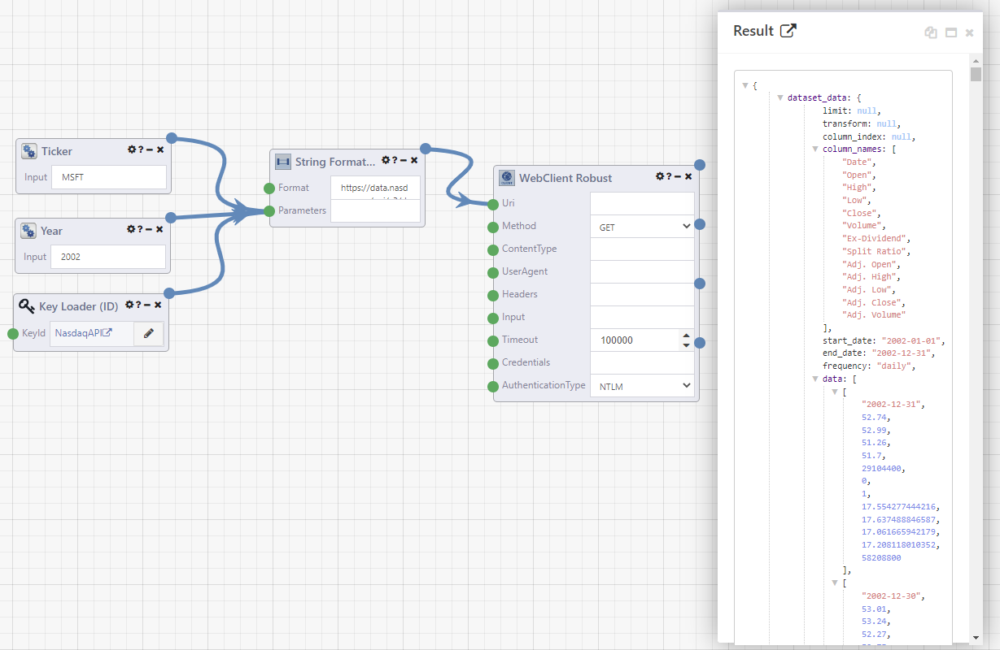

Bam!

## Wrapping up ##

At this point, I am going to head over to the **[Composable Blog](https://blog.composable.ai/)** to the **Did You Know (DYK)** posts for **[Changing Wire Type](https://blog.composable.ai/2022/09/06/did-you-know--changing-wire-type/)** and **[Adding Comments](https://blog.composable.ai/2022/09/06/did-you-know--adding-comments/)**, which will each let me add a little more to the visual of this DataFlow.
I will incorporate those into the version of the DataFlow used when we pick up in the next lab, but they are not required.

Whether you want to follow those DYKs now, later, or ever is up to you.

In any event, we are ready to wrap up this lab and do a final Save for now.

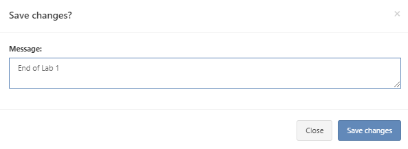

## Let's review… ##

Here's what we set out to do at the beginning of the lab.

### What you'll learn ###

- How to store values centrally for shared, repeatable, access-controlled use
- How to connect to an API with a Composable DataFlow
- Spotlight: How to evaluate module choices for a given task
- How to review module output
- How to parameterize strings
- DYK: How to change connectors and add comments within a DataFlow

### To accomplish those goals, we... ###

- Created a Key to mask our API credential.
- Created a DataFlow, added a WebClient Robust module, and adjusted the inputs.
- Spotlight: Compared structure, and success/failure behavior of similar modules.
- Looked at the Results of our API pull and, in the Spotlight, we explored other output.
- Abstracted the API string from hard-coded into an input-driven collection of modules.
- DYK: Commented our DataFlow and changed the Wire Type.

### End result ###

We now have a parameterized, credentialled, easily-reusable, internally-documented connection to pull NASDAQ data into JSON format.

### In future labs in this series, we will learn... ###

- How to convert JSON into Table format.
- How to automate reading the JSON structure to help define our table structure.
- How to iterate with modules.
- How to use a subset of modules to create a customized reference module.
- How to augment table-formatted data.
- How to create a back-end data store.
- How to load data from our DataFlow into a data store.
- … and more.

See you next time…