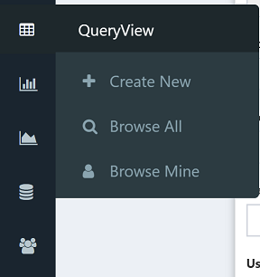

# Overview

Composable QueryViews provides a modern web-based approach for running interactive, distributed SQL queries. Simply use a Composable [Key](../Keys/01.Overview.md) to connect to a SQL data source, and query the data where it lives. This includes relational databases or non-traditional data stores such as Hive!

QueryViews are great at creating live datagrids of data, and provide an interface for just-in-time, interactive analytics. With built-in paging, you can query millions of rows of data, and page through the results.

To get started, simply click on the datagrid icon in the sidebar:

