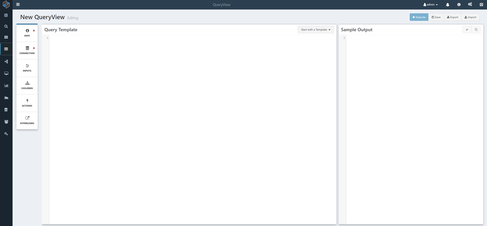
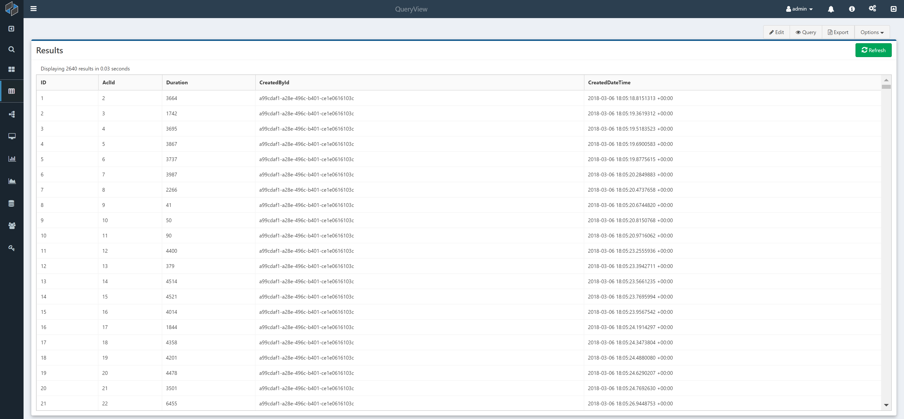

# QueryView Basics

This page describes the QueryView interface and how to setup a QueryView.

## QueryView Configuration

After clicking the Create New QueryView icon, you will be presented with a new, blank QueryView in Edit mode. A QueryView has two modes: **Edit mode**, which allows you to edit the configuration, settings and query, and **View mode**, which allows you to view the results.

The QueryView Edit mode looks as follows:

Note the three sections: a set of configuration menu items on the left, the query template window, and the sample output window. You will need to set values in Info and Connection to run/save a query.

## Edit Menu Items

Pages to configure a QueryView are in the menu on the left of Edit mode.

- **Info**: On this modal, enter in the QueryView name, description, and other global settings.
    - **Name**: The name of the QueryView. Must be Named before Saving
    - **ID**: The Composable ID that can be used to refer to the QueryView is other applications.
    - **Description**: A description field to provide more information or context on the QueryView.
    - **Folder**: Used for organizing and sharing resources
    - **Tags**: Add tags to help searching for resources
    - [**Paging Type**](./Paging.md): Set how the results will display. Options are **None** which displays the entire result, **Limit** the number of rows (displayed on one page). **Auto** and **Full** provide paging functionality. Auto takes care of the paging, whereas for Full the user sets the paging paramters in the query. 
    - **Default Order Column**: Column order that goes after an `ORDER BY` clause for result ordering. Can either be column numbers, or column names.
    - **Auto-Execute on Page Load**: If unselected, the `Refresh` will need to be clicked to load results
    - **Auto-Refresh on Input Change**: If selected, the results will refresh as literal or filter [Inputs](./Inputs.md) are changed. If unselected, clicking the refresh button will refresh the results
    - **Display `NULL` Values as Blank**: If unselected, `NULL` fields will display as `NULL`. If selected, the fields will be blank.

- **Connection**: Here, select the [Composable Key](../Keys/01.Overview.md) to connect to the data store of your choice.

- [**Inputs**](./Inputs.md): Configure literal and filter parameters whose values can be set in View Mode of the query.
- [**Children**](./ChildrenQueries.md): Allow you to expand each row of this queryview to bring up additional details. When expanded, a row will execute and display the child QueryViews selected below. These can accept values from the expanded row as inputs, allowing you to dive deep into additional information related to the expanded row.
- [**Actions**](./Actions.md): Linking a DataFlow as an action will include a button(s) adjacent to this QueryView's result table that allows you to execute a DataFlow with the `QueryView Input` module using data from the QueryView as input data. This can be used to create powerful interactivity between the data your QueryView displays and related DataFlows you've authored.
- [**HyperLinks**](./Hyperlinks.md): Configure a hyperlink for each row that can reference data values in the row

## Writing the Query

In the Query Template Window of Edit mode, you can write your SQL statement.

As an example, you can do the following:

Note that as you write your SQL statement, Composable checks and converts your query into a syntactically correct SQL statement viewable in the **Sample Output** window on the right. This fills in example values for [input parameters](./Inputs.md) so you can ensure that your SQL query is correct. The checkbox icon will turn green when clicked if your syntax is valid.

!!! note
    Composable will execute this query on the underlying SQL host you select via the Composable Key. So you can write your SQL in any flavor of the language (e.g., for Oracle, DB2, MSSQL, Hive, etc.! 

## Viewing and Saving

You can now switch to the View mode by clicking on the Execute button. A grid of results will appear.

You can switch back and forth between Edit and View to iterate on the query. Click on the Save button to save the QueryView.

!!! note
    Once a QueryView is saved, you can share the QueryView, and also place it in a Folder or add Tags to it (found in the Info modal). A full revision history will also be available.

## Sharing QueryViews

QueryViews can be imported/exported in a json format to be shared across Composable instances. There are button for these actions in the top right corner of a QueryView.

