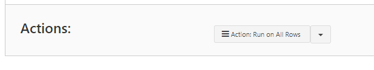
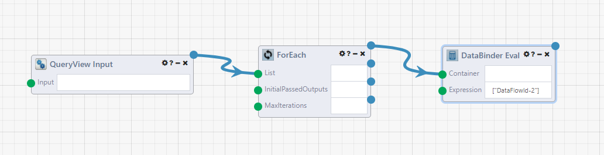

# QueryView Actions

A QueryView action can be linked to a [DataFlow](../DataFlows/01.Overview.md) with the `QueryView Input` module. In the QueryView a button is added to the View mode that can run the DataFlow with the values of the rows as the module inputs.

### Settings

- **Name**: The label that will be displayed on the button for the action in the QueryView
- **Type / Display**: Set the behavior for the action button and the location.
  - 'Single Row: Display Before Data' : A button will appear in the first column of each row. Clicking it will run the DataFlow application with the data from the row as input
  - 'Single Row: Display After Data' : A button will appear in the last column of each row. Clicking it will run the DataFlow application with the data from the row as input
  - Multiple Rows: The first column of the data will be a checkbox input, and the action button will be on the bottom of the page. Any selected rows will be the input for the QueryView Input module in the linked DataFlow application.
  - All Rows (on all pages): The button on the bottom of QueryView view mode will use all rows of the result table as the input for the QueryView Input module in the linked DataFlow application.
- **Application ID**: Select which DataFlow application will be run. Clicking this field will bring up a modal which will display all of the DataFlows with the `QueryView Input` module. 

## DataFlows using the QueryView Input Module

A DataFlow with the `QueryView Input` module needs to be created before you can link to it as an Action in your QueryView. The start of your QueryView will have a similar starting structure.

First, add the `QueryView Input` module. The Results of this module are the row(s) of your QueryView. Hovering over the output node shows that it is of type `List<Dictionary<String,Object>>`. This means it is a list of where each element is a row of the QueryView. Each row consists of a column name and value in a `<String, Object>` dictionary pair.

Next, connect the `QueryView Input` to the `List` input of a `ForEach` module. This iterates through each item (row) in the list.

Then connect one or multiple `DataBinder Eval` modules from the first output node of the `ForEach` module. The `DataBinder Eval` module can be used to select values from a dictionary based on the name of the    key name. If you have tried clicking the Action button in your QueryView and looking at the results of the modules so far, you will see the rows are in the format `<ColumnName>-<ColumnNumber>`. Connect multiple `DataBinder Eval` modules to access multiple values from the row. As the `Expression`, use the key of the QueryView results, which is in the format `["<ColumnName>-<ColumnNumber>"]` .

From here, complete your DataFlow with the modules/functionality you want using the values of the QueryView row.

