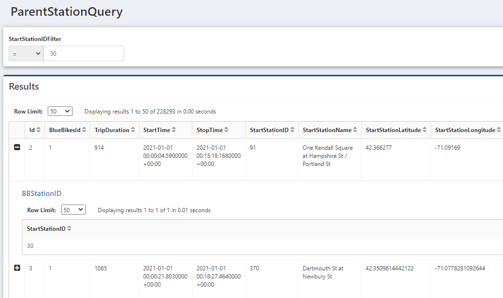

# Child QueryViews

In a QueryView, you can link another QueryView which will create dropdowns on the rows of your QueryViews to display additional details. When expanded, the selected child QueryViews runs. The Child QueryView inputs can reference either values from the row or the inputs of the parent QueryView.

### Settings

The setting 'Allow Multiple Child Row Expansions at Once' allows the child QueryView to be shown on multiple rows at the same time. If this setting is unselected, then if the expand button for a child QueryView is clicked on a row, the open row will collapse, and the new row will expand.

## Add a Child QueryView

To add a child QueryView, click the `Children` icon in the Edit View, then click `Add New`. Select the QueryView you want to be the child, then click `Select Resource` at the bottom of the modal. When Executing the parent QueryView, there will now be a plus button on each row. Clicking it will show the child QueryView.

## Using Parent Values

Values from the Parent QueryView can be used as inputs for the child QueryView when it is expanded.

First, set the `Parent Override` in the child QueryView.

- **Only override with parent data row values**: If a column in the parent QueryView matches the `Display Name` of this input, the input value will be the value of the parent column in that row
- **Allow parent input values to override**: If the parent and child QueryViews both have inputs with the same `Display Name`, then the child QueryView input value will be the input of the parent QueryView. However, a column name in the parent QueryView takes priority over an input Display Name if they are the same.

