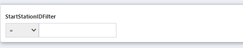

# QueryView Inputs

Inputs give the user viewing the QueryView the ability to define input values. These can either be Literals or Filters.

**Literals** are a type of input that simply inserts a provided value at the desired location in the query. They are a single value, constrained by type.

**Filters** are *optional* `WHERE` clauses that are added to the query only if a value was provided. If a filter input is blank, the filter will not be applied.

Inputs can be added to the query using their **Template Name**, which is surrounded by two curly braces, like ``

!!! note
    When you add a filter into your query, it starts with `AND`. So if your where clause only has one filter, use `WHERE 1=1` before the filter.

## Creating an Input (Input Settings)

- **Display Name** (required): The text that shows next to the input selection in View Mode
- **Template Name**  (required): The name to use in your query to reference the input using double curly brackets. Example: ``
- **DataType** (required): The DataType of the input.
- **DefaultValue**: Enter an initial initial value for the input when the query is loaded
- **ChoicesQuery**: Instead of a field for values, you can provide a selection of values to choose from using a table in your database. 
  - If the entered query is only one column, the selected value will be the input value.
  - If the query is a lookup field with two columns in the format of `Id, Value`, the value will be displayed to the user, but when selected, the id will be the actual input into the query.
  - When you enter a ChoicesQuery, you will see that the `Default Value` field will run the query, and show the values to choose from.
- **Parent Override**: If this QueryView is the [child QueryView](./ChildrenQueries.md) of another Query, select the behavior for which values it uses from the parent query.
  - Only override with parent data row values: If a column in the parent QueryView matches the `Display Name` of this input, the input value will be the value of the parent column in that row
  - Allow parent input values to override: If the parent and child QueryViews both have inputs with the same `Display Name`, then the input value will be the input of the parent input. A column name in the parent QueryView takes priority over an input Display Name.

- **Position**: Choice between displaying the input field above the query results or on the side
- **Hidden**: Hide the input from being visible. It will still apply if it has a default value.
- **Visible as Child**: If selected, and this QueryView is a child of another QueryView, this filter will be displayed on the parent QueryView view mode.

**Filter only Settings**

- **Multi-Choice**: Allow selection of multiple values in a choice query.
- **Search Type**:
  - **Single Column Search**: Creates a filter to compare the input value to a column value of the query. It goes in the where clause in the format of `AND <Column> <operator> <UserInput`
    - **Column**: The column to compare the input value to.
    - **Default Operator** (required): The operator to compare the column and input values, such as `=`, `>`, `LIKE`.
      - DataType must be selected before choosing the Default Operator.
    - **Allow Operator Changes**: If selected, the user in View Mode can also change which operator to use
  - **Custom SQL**: Write SQL that can be part of your query. Use double curly brackets in the query to reference the input value (the text inside the curly brackets will be ignored)

## Built-In Inputs

There are some already sepcified inputs that can be used for functionality. These can be used in paging, ordering, and filtering with values set in the QueryView. All of these are literals except `{{ allFilters }}`.

The built-in Parameters are case-sensitive.

| Parameter            | Description                                                  |
| -------------------- | ------------------------------------------------------------ |
| {{ allFilters }}     | Adds  in all of the filters created in the Input panel, to put in a `WHERE` clause. Usage example: `WHERE 1=1 AND {{allFilters}}` |
| {{ order }}          | Orders the results on the `Default Order Column` specified in the Info panel |
| {{ inverseOrder }}   | Orders the results on the `Default Order Column` specified in the Info panel in the inverse order |
| {{ pageStart }}      | Beginning row number for paging                              |
| {{ pageEnd }}        | End row number for paging                                    |
| {{ limit }}          | Number of rows to display on page. Value can be set in View mode paging features |
| {{ user.UserName }}  | Username of the composable account                           |
| {{ user.FirstName }} | First name of the Composable Account                         |
| {{ user.LastName }}  | Last Name of the Composable Account                          |
| {{ user.Id }}        | Id of the Composable account                                 |
| {{ tzOffset }}       | Database Timezone offset (eg '-05:00')                       |

