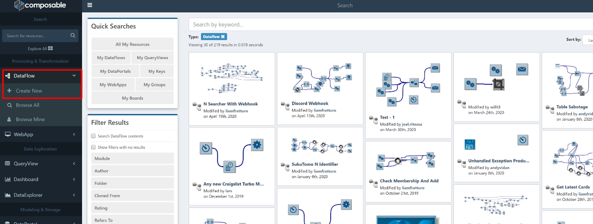
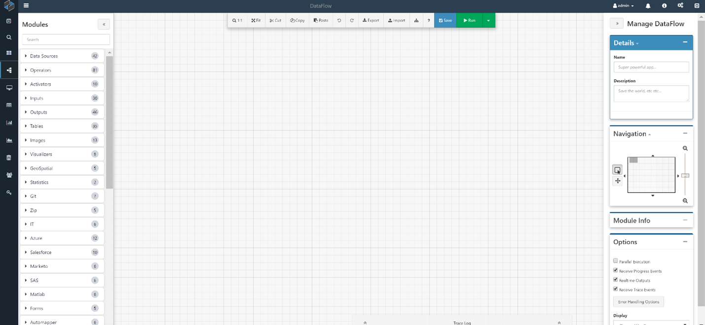
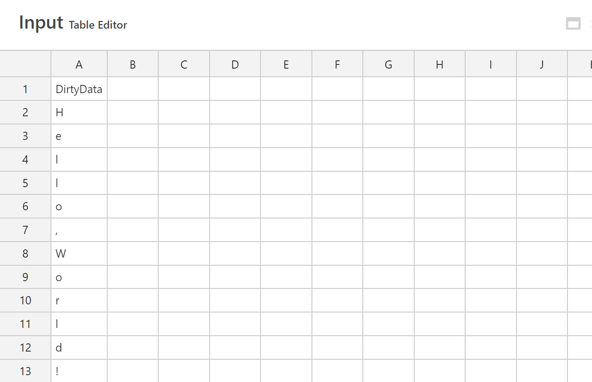
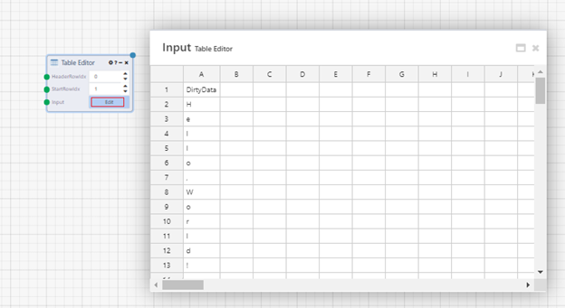
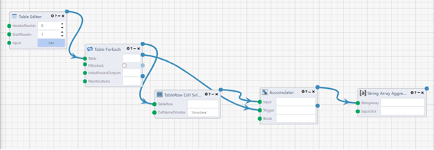
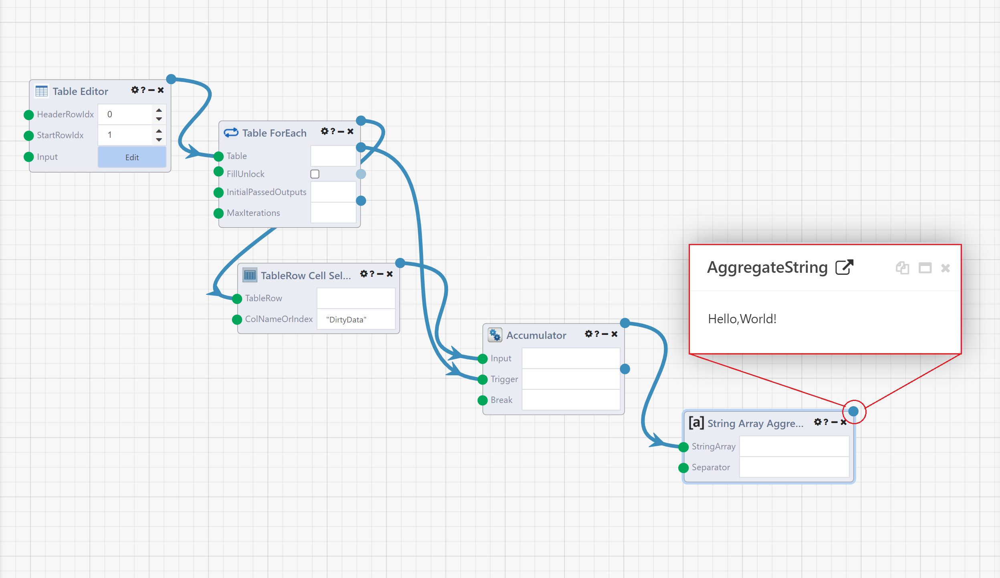

# A "Hello, World!" DataFlow Exercise

This is a simple DataFlow that will introduce you to a few concepts, including entering in a table using the Table Editor Module and looping over rows in a table.

1.	Create a new DataFlow by clicking on the DataFlow icon or select DataFlow > Create New from the side menu.

The Composable Designer will load, and you will be presented with a new canvas as shown below.
 

2.	We will start with some "dirty" data. Imagine being given a spreadsheet with just a single column, with letters arranged as follows:

In Composable, we can upload this data as a *csv/txt/xls/xlsx* file, or we can use the **Table Editor Module** to create this table on the fly. Here, we will use the **Table Editor Module**.

Find the **Table Editor Module** in the Module Library on the left. Drag and Drop this Module onto the canvas and click Edit, and enter in the data as shown.

3.	Now, we will loop through the rows and accumulate the data into a single string.

4.	Select the following modules to create a loop:
a.	**Table ForEach** – acts as a For Loop over the columns
b.	**TableRow Cell Selector** – Allows you to choose a Column (here, "DirtyData") to select, and will give you a given cell value from the table on each loop iteration
c.	**Accumulator** – Will accumulate results over the loop; provide an input, and the trigger for when the loop completes
d.	**String Array Aggregator** – To aggregate the array into a string

Your DataFlow should look like:

5.	Click Run, and right click on the final output to see the results.
 
