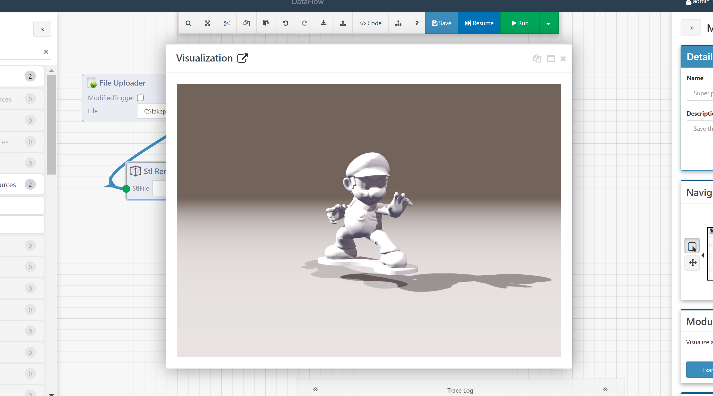
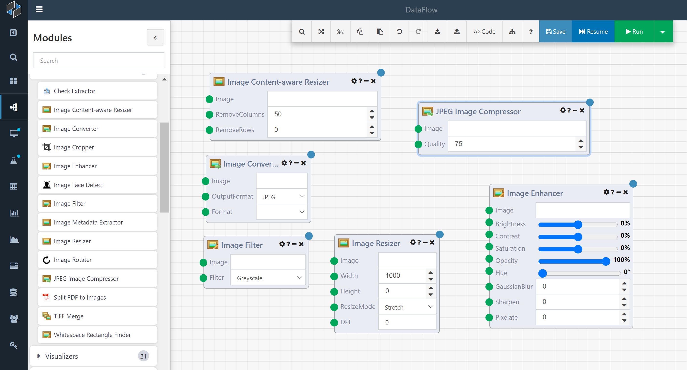
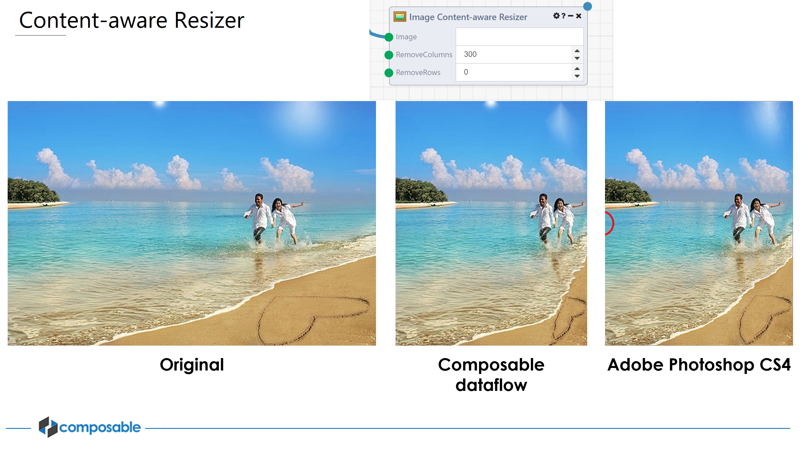
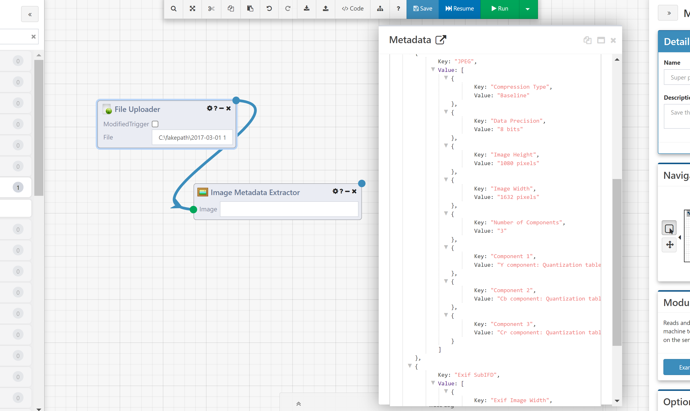
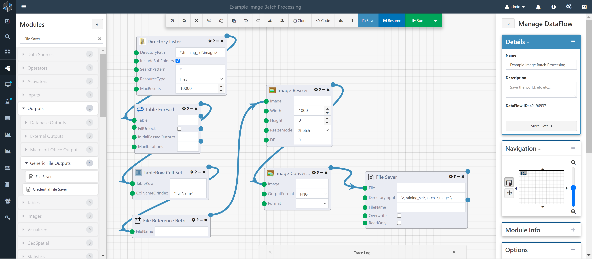

# A "Hello, World!" DataFlow Exercise

This is a simple DataFlow that will introduce you to a few concepts, including entering in a table using the Table Editor Module and looping over rows in a table.

1.	Create a new DataFlow by clicking on the DataFlow icon or select DataFlow > Create New from the side menu.

The Composable Designer will load, and you will be presented with a new canvas as shown below.
 

2.	We will start with some "dirty" data. Imagine being given a spreadsheet with just a single column, with letters arranged as follows:

In Composable, we can upload this data as a *csv/txt/xls/xlsx* file, or we can use the **Table Editor Module** to create this table on the fly. Here, we will use the **Table Editor Module**.

Find the **Table Editor Module** in the Module Library on the left. Drag and Drop this Module onto the canvas and click Edit, and enter in the data as shown.

3.	Now, we will loop through the rows and accumulate the data into a single string.

4.	Select the following modules to create a loop:
a.	**Table ForEach** – acts as a For Loop over the columns
b.	**TableRow Cell Selector** – Allows you to choose a Column (here, "DirtyData") to select, and will give you a given cell value from the table on each loop iteration
c.	**Accumulator** – Will accumulate results over the loop; provide an input, and the trigger for when the loop completes
d.	**String Array Aggregator** – To aggregate the array into a string

Your DataFlow should look like:

5.	Click Run, and right click on the final output to see the results.
 

Image Processing DataFlows

Composable is not just a *big data* platform, but it is a true *all data* platform. DataFlows are able to pass not just tabular data, but files, documents, pdfs, images, etc. As an end-to-end data discovery, orchestration, analysis, and visualization platform, Composable offers integration with all sorts of data sources that you can prep, curate and integrate, along with visualization and reporting capabilities, and includes powerful dashboard tools.

Here, we will show some examples of Image Processing capabilities that one can execute with DataFlows.

## STL Data Visualizer

The Stl Renderer Module takes in an .stl file (used in 3D printing, CAD, etc.) and renders it in your browser using WebGL. Simply use the File Uploader Module to upload an .stl file and pipe it into the Stl Renderer Module (located under the "Visualizations" category in the Module Library palette):

Execute the DataFlow by clicking `Run` to visualize the .stl files. Click on the blue Module output dot and the stl visualization will appear:

 

## Batch Image Processing

When you're working with large numbers of images, using standard tools like ImageMagick can often feel like an endless cycle of combing through man pages and StackOverflow posts to find the magical sequence of flags to get the results you want. And when you finally get your command working, coming back to it weeks or months later can leave you feeling lost.

Command Line Interfaces (CLIs) are just not the right tool for the job when it comes to processing pipelines for visual data. In this section, we will demonstrate a full-featured image processing workflow using Composable DataFlows. The first-class support for the most common image processing operations are available as Modules that enable you to build complex, multi-stage processing pipelines using the visual, drag-and-drop flow-based DataFlow programming methodology. Each DataFlow gives you a visual representation of the processing steps, the order in which they're applied, and access to the way your files look at every stage in the pipeline. And, your image processing tasks can be shared and improved on by others on your team, and the visual DataFlow layout ensures that everyone can easily understand how all the steps are laid out — something more elusive when sharing command line statements.

Creating a DataFlow to manipulate images could not be simpler. Just get access to your image file(s) using one of our existing file Modules, like the File Uploader, File Retriever, or Directory Lister. Then, once you have a URI or FileReference pointing at an image, you can simply use that as the input to one of the image processing Modules. 

The image processing Modules are generally available in the Images category of the Module Library. A description of some of the available Modules is provided below.

 

- The **Image Cropper Module** can shave pixels from any side of an image. Like all the editing Modules, it saves the output image in its original format.
- The **Image Rotater Module** allows for correction of incorrectly-oriented images.
- The **Image Resizer Module** can resize to a specified width or height, preserving aspect ratio, or stretch/shrink the image to a particular height and width.
- The **Image Converter Module** supports converting between PNG, JPEG, GIF, TIFF, and BMP image formats.
- The **JPEG Image Compressor Module** supports saving images as JPEG with a particular compression setting, between 0 and 100. This can be used to reduce file sizes.

In addition to these image editing Modules, DataFlows also support support stylistic changes to images.

- The **Image Enhancer Module** allows you to apply a wide range of post-processing settings, including Brightness, Contrast, Saturation, Opacity, Hue shifting, Blurring, Sharpening, and Mosaic Pixellation.
- The **Image Filter Module** can apply commonly used stylistic filters, like Greyscale, Black & White, and Sepia.

Composable also supports some higher-end post-processing jobs:

- The **Content-aware Resizer Module** allows you to change your image's aspect ratio while preserving the proportions of important image features, like people and buildings. The image below shows the performance of Composable's Content-aware Resizer Module compared to the same functionality available in Adobe Photoshop.

Image processing normally includes processing any available image metadata.

- The **Image Metadata Extractor Module** can extract all relevant image metadata from a file, including camera EXIF data, publisher XMP and IPTC tags, and filesystem metadata. This single Module can save a user a lot of time compared to writing Python scripts to extract these features.

A portion of the extracted metadata is shown below:

The image processing Modules in Composable are **not** limited to working on just one image. Composable's DataFlow model lends itself to defining repeatable batch processes that operate on whole folders or drives of images at once. With a simple Directory Lister and ForEach Module, you can set up your processing pipeline to loop over every image in a folder or even an entire drive. The Multi-file Uploader can also be used to submit many images at a time, without the need for zipping or emailing your images before processing. 

!!! note
    This high-performance batch processing of files and images is one of the main benefits of using Composable DataFlows. While other tools (e.g., Adobe Photoshop) clearly have the same image processing functionality, setting up and performing repeatable image processing tasks in batch is easier in Composable.

The image below shows an example of working on an entire directory of images at once to resize and convert the images.

You can download and then import a copy of this DataFlow here: <a href="../../Tutorial/img/Example Image Batch Processing.json" download="Example Image Batch Processing.json">Download 'Example Image Batch Processing.json'</a> 
