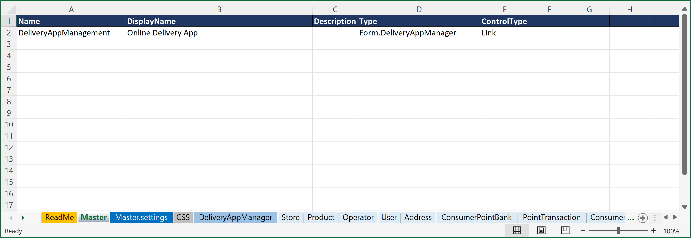
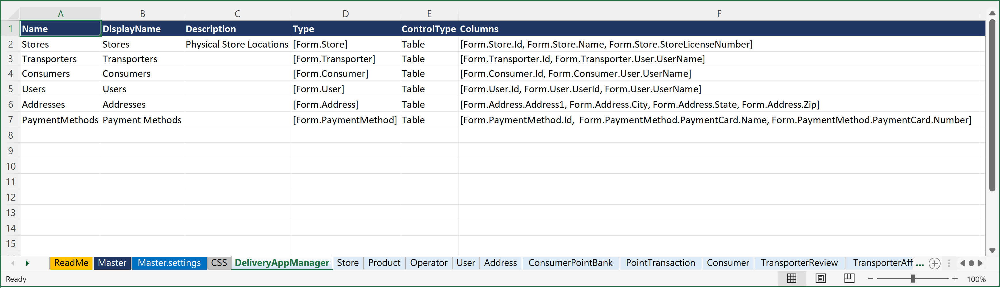
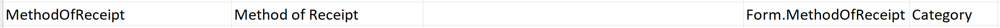
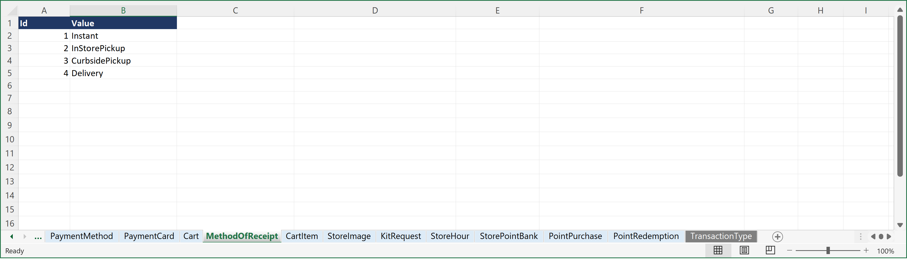
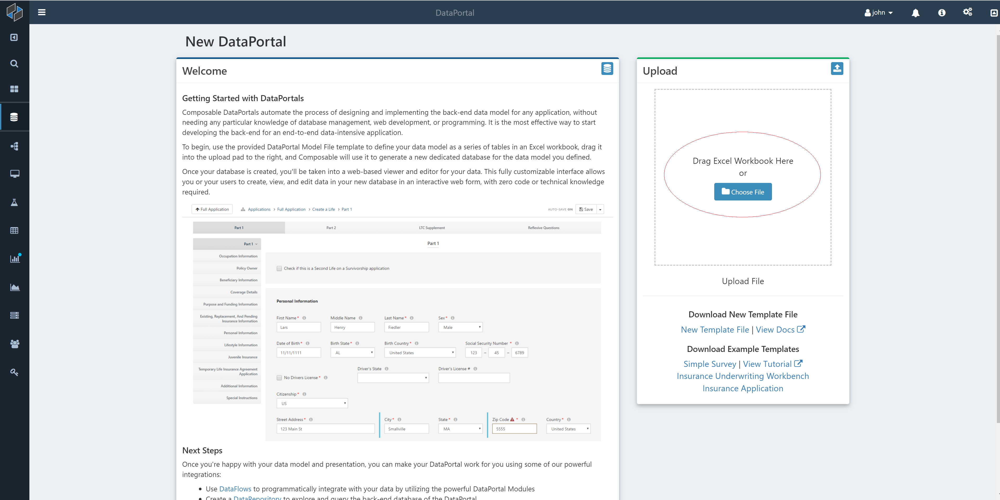
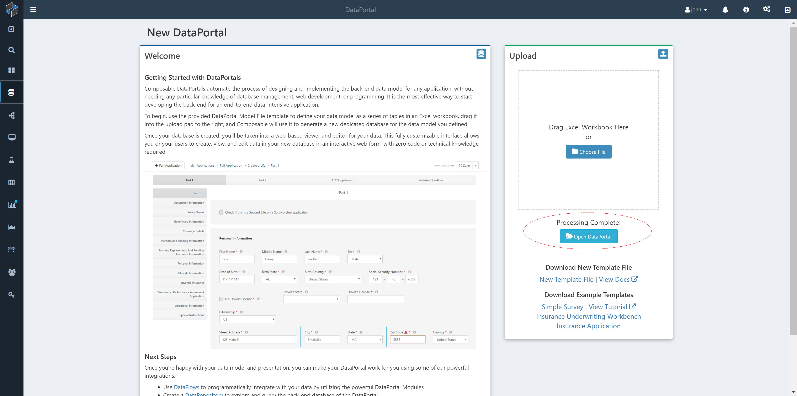

# Introduction

In this tutorial, we will create a [DataPortal](../DataPortals/01.Overview.md) that will be used as the back-end for an online (web or mobile) delivery application. Delivery apps for food, drinks, medicine, and other items are ubiquiotous. Most of you that are reading this tutorial have no doubt used a delivery app at least once this week, or even this day! Several common delivery apps include UberEats, DoorDash, and Grubhub for food delivery; Instacart for grocery delivery, and Drizly and Saucey for alcoholic beverages delivery.

Software engineers looking to implement a new online delivery app must begin by designing a data model for the application. The delivery app data model tends to grow in complexity as entities and relationships are added to capture all the moving pieces, including the customers, delivery drivers, store locations, available products, payments, rewards, and so on. Once a data model is defined, the back-end database needs to be implemented, along with the other typical components of the full application, such as the ORM layer, web services, and web interfaces. This process is extremely time-consuming, and requires sophisticated software architecture and engineering knowledge for data modeling, database management, and web development. Composable [DataPortals](../DataPortals/01.Overview.md) provides a scalable, repeatable and robust approach to performing ***all*** of these tasks, and via a ***low-code*** approach, you can automatically generate the required back-end database, ORM layer and web interface in minutes.

## Online Delivery App

This tutorial will present a detailed data model for a generic delivery app. The data model can be used immediately in production, or as a starting point that can be enhanced to include additional business requirements.

## DataPortal Model File

We will be using a Composable [DataPortal](../DataPortals/01.Overview.md) to implement our back-end database and front-end web interface. As noted elsewhere in the Docs, all DataPortals start with a data model that is defined in an Excel workbook. The Excel model file used in this tutorial is available here: <a href="../../Tutorial/img/DataPortals_Model_DeliveryApp.xlsx" download="DataPortals_Model_DeliveryApp.xlsx">DownloadDelivery App DataPortal Model (xlxs)</a> 

## Master Container

We begin by defining a [`Master`](../DataPortals/03.MasterSheet.md) sheet that points to the container that will serve as the root of our application. Specifically, we'll set it to point to the `DeliveryAppManager` container we will define in the next step.

We will set the [`Name`](../DataPortals/06.Setting-Details/Name.md) of our DataPortal (and the name of the database that will be created to store its data) to `DeliveryAppManagement`, [`DisplayName`](../DataPortals/06.Setting-Details/DisplayName.md) to "Online Delivery App", [`Type`](../DataPortals/06.Setting-Details/Type.md) to `Form.DeliveryAppManager`, and [ControlType](../DataPortals/06.Setting-Details/ControlType.md) to [`Link`](../DataPortals/05.Control-Details/Link.md).

## DeliveryAppManager Container

With our Master sheet defined, we will now create a parent container called `DeliveryAppManager` that will contain records of our parent entities, specifically: 

- Stores
- Transporters
- Consumers
- Users
- Addresses
- PaymentMethods

Each of these are set with the ControlType [`Table`](../DataPortals/05.Control-Details/Table.md), indicating that we would like a table of all the respective records for each of these entities. The [`Type`](../DataPortals/06.Setting-Details/Type.md) for each of these Table fields are of the form `[Form.<entity>]`, with brackets indicating an array of our entity containers (which we will define next). We also pick out some of the fields from each of these containers to be displayed in the table, via the [`Columns`](../DataPortals/06.Setting-Details/Columns.md) column.

## Container Pages

Each of our entities listed above, and their related entities, are represented in a separate sheet in the Excel DataPortal Model File. These include:

- Store
- Product
- Operator
- User
- Address
- ConsumerPointBank
- PointTransaction
- Consumer
- TransporterReview
- TransporterAffiliation
- TransporterTimeSlot
- Transporter
- Vehicle
- DriversLicense
- DeliveryBatch
- DeliveryOrder
- FavoriteStore
- ConsumerPaymentMethod
- PaymentMethod
- PaymentCard
- Cart
- CartItem
- StoreImage
- KitRequest
- StoreHour
- StorePointBank
- PointPurchase
- PointRedemption

## Category Sheets

The data model also includes pre-defined field value lists (e.g., set values that appear in drop-down lists). These category fields are specified with the `ControlType` of [Category](../DataPortals/05.Control-Details/Category.md). In this data model, we have two such sheets in the Excel workbook that list out specific field values. These are:

- MethodOfReceipt
- TransactionType

These can then be referenced as a [`Type`](../DataPortals/06.Setting-Details/Type.md) via the `Form.<ListName>` syntax.

For example, **MethodOfReceipt** is deined in the **Cart** container with [`Type`](../DataPortals/06.Setting-Details/Type.md): **Form.MethodOfReceipt** and `ControlType` of [Category](../DataPortals/05.Control-Details/Category.md):

And a separate sheet called **MethodOfReceipt** is created that lists the field values:

## Upload DataPortal

To build the DataPortal, simply upload the Excel workbook to Composable.

To upload the DataPortal model file (Excel Workbook), create a new DataPortal and either click the `Choose File` button, or drag your file over to the upload box.

In the background Composable creates your database. Once it's finished processing, click on the `Open DataPortal` button and you'll be brought to the homepage of your DataPortal, which will initially look empty, since there is no workload log data yet that has been added.

## Summary

This tutorial presented a detailed data model for an online delivery application, defined in a Composable [DataPortal](../DataPortals/01.Overview.md) Model File that can be used to automatically generate a back-end data store, ORM layer and web interface for a production-grade web application.