# Introduction

In this tutorial, we will create a [DataPortal](../DataPortals/01.Overview.md) that will be used to collect data using a survey form.

When building even a simple survey form, and especially for more comprehensive applications or data science and machine learning processes, we typically have to start by thinking about defining and implementing a new data model that will store our curated data. This is not always a simple task! Defining a new data model can be a fairly difficult and time consuming process, from build the database itself, along with all the tables and relationships required to represent our data model, to implementing an ORM (object–relational mapper) layer that allows our application to interact with our data, to building out the full front-end, web-based user interface.

You may be tempted by using an off-the-shelf, pre-built solution. Google Forms & SurveyMonkey immediately come to mind. Both solutions let you build up a form interface online and send it out to recipients to get your data collection process started. But what are you really getting out of a simple solution like Google's?

- Your data is limited to a totally flat table format: if it doesn't fit in a single row of a spreadsheet, you can't model it. That means no one-to-many relationships, no data hierarchy, no foreign-key relationships, and minimal complexity. For demanding modeling applications, this simply is unacceptable.
- You may get a clean interface for inputting data, but it isn't very flexible. Layout is limited, and nothing more involved than a simple step-by-step wizard can be deployed to help your users fill in the data you need.
- Access to data is constrained, or oftentimes, completeley blocked. You may be allowed to export your data as a CSV, Excel or Google Sheet. Spreadsheet software is great in a pinch, but it's no substitute for a real database. You'll find yourself severely limited when searching, reporting, visualizing, or simply browsing larger data sets.

[Composable DataPortals](../DataPortals/01.Overview.md) solves these challenges, and provide a powerful end-to-end data modeling solution.

## The DataPortal Model File

We'll be designing a simple survey form. All DataPortals start with a data model that is defined in an Excel workbook. The Excel model file used in this tutorial is available here: <a href="../../Tutorial/img/BlueBikesDataPortal.xlsx" download="BlueBikesDataPortal.xlsx">Download Simple Survey DataPortal Model (xlxs)</a> 

## The Survey Container Page

We begin by first creating the container where we will be storing the survey data. This will be a new sheet in the Excel DataPortal Model File called **Survey**. This is where we define the schema of the survey table in the database that will be created for us, as well as the layout and other attributes that will be used to create the web-based interface.

The table and screenshot below shows our design for the "Survey" page. We have fields for First & Last Name, DOB, Gender, and a free-form text Feedback box. For each field, we define a row with a few pieces of metadata, including:

- [`Name`](../DataPortals/06.Setting-Details/Name.md): A whitespace-free name for the field. Think of this as the name you would give this field's column in a database.

!!!note
    The [`Name`](../DataPortals/06.Setting-Details/Name.md) field will be used as column names in the underlying database, and will not be shown to users (that's what [`DisplayName`](../DataPortals/06.Setting-Details/DisplayName.md) is for). Therefore, it is advisable to choose names that make good database column names, that do not contain any whitespace.

- [`DisplayName`](../DataPortals/06.Setting-Details/DisplayName.md): A human-friendly label that will be displayed above the input box for the field on the form interface.

!!!note
    Note the special case for [Label](../DataPortals/05.Control-Details/Label.md) fields. [`DisplayName`](../DataPortals/06.Setting-Details/DisplayName.md) contains rich text written in Markdown.

- `Description`: A longer clarification that can be displayed in a tooltip to more fully explain the field.
- [`Type`](../DataPortals/06.Setting-Details/Type.md): The name of the data type of the given field.
- `ControlType`: The type of form control that will be shown to the user to input their data for this field.
- `Required`: Indicates whether the field is required.

| [Name](../DataPortals/06.Setting-Details/Name.md) | [DisplayName](../DataPortals/06.Setting-Details/DisplayName.md) | [Description](../DataPortals/06.Setting-Details/Description.md) | [Type](../DataPortals/06.Setting-Details/Type.md) | [ControlType](../DataPortals/06.Setting-Details/ControlType.md) | [Required](../DataPortals/06.Setting-Details/Required.md) |
| ------------------------------------------------- | ------------------------------------------------------------ | ------------------------------------------------------------ | ------------------------------------------------- | ------------------------------------------------------------ | --------------------------------------------------------- |
| Instructions                                      | **Welcome to our Survey**                                    |                                                              | `System.String`                                   | [Label](../DataPortals/05.Control-Details/Label.md)          |                                                           |
| FirstName                                         | First Name                                                   |                                                              | `System.String`                                   | [Text](../DataPortals/05.Control-Details/Text.md)            | TRUE                                                      |
| LastName                                          | Last Name                                                    |                                                              | `System.String`                                   | [Text](../DataPortals/05.Control-Details/Text.md)            | TRUE                                                      |
| DOB                                               | Date of Birth                                                |                                                              | `System.DateTimeOffset`                           | [Date](../DataPortals/05.Control-Details/Date.md)        | TRUE                                                      |
| Gender                                            | Gender                                                       |                                                              | `Form.Gender`                                     | [Category](../DataPortals/05.Control-Details/Category.md)    |
| Feedback                                          | Please provide any thoughts you would like to convey.        |                                                              | `System.String`                                   | [Textarea](../DataPortals/05.Control-Details/Textarea.md)        |                                                           |

As you can see from the table above and screenshot below, we set up the "Survey" page by listing each of the fields we would like to collect in the survey data. along with their properties.

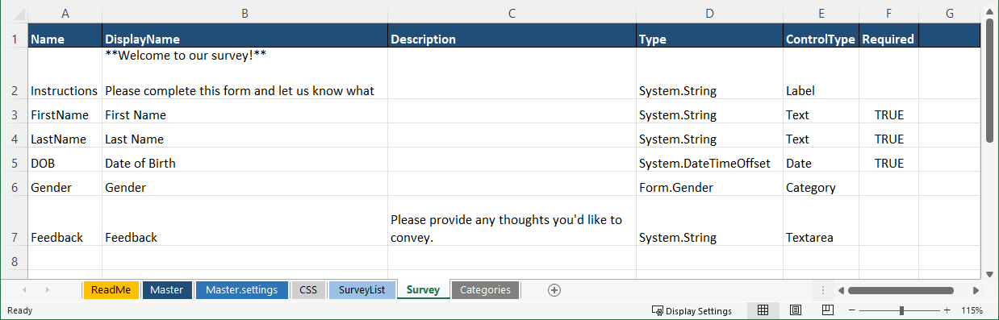

## The Categories Sheet

Note the special Type present for our 'Gender' field. Here, the `ControlType` is a [Category](../DataPortals/05.Control-Details/Category.md), which gives us the ability to define a drop-down list of options. We can define this list of options in a separate sheet in the Excel workbook, called `Categories`. In this sheet, as shown below, simply define all of your drop-down lists in a single column each, with the name of the list in the first row. Then, you can reference the list as a Type via the `Form.<ListName>` syntax.

In our survey example, the [`Categories`](../DataPortals/05.Categories.md) sheet defines just one Category list: Gender. We reference this in our Survey container as `Form.Gender`. So we make "Gender" the header of a column of the [`Categories`](../DataPortals/05.Categories.md) sheet, and we can list out several values, such as `Female` and `Male`.

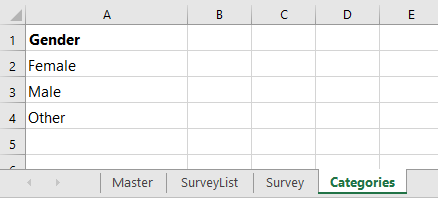

## The SurveyList Container

With our survey page (or, as we refer to pages, "containers") defined, let's create a parent page called `SurveyList` that allows us to create multiple survey instances, creating a one-to-many relationship in our data model. Here, we use the ControlType [`Table`](../DataPortals/05.Control-Details/Table.md), indicating that we would like a table of all the survey instances. Note that the data type for the Table field is `[Form.Survey]`, with brackets indicating an array of our Survey containers. We also pick out some of the fields from our Survey container to be displayed in the table, via the [`Columns`](../DataPortals/06.Setting-Details/Columns.md) column shown below in the last column on the right.

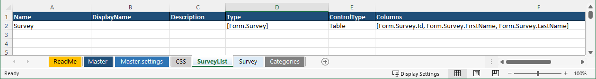

## The Master Container

Finally, we need to create a [`Master`](../DataPortals/03.MasterSheet.md) sheet that points `Forms` to the container we would like to use as the root of our survey form. We'll use the `SurveyList` container we defined in the last step. Our `ControlType` here is always [`Link`](../DataPortals/05.Control-Details/Link.md), and we select the container by writing its fully-qualified name (including the `Form.` prefix) in the [`Type`](../DataPortals/06.Setting-Details/Type.md) column. Also in this [`Master`](../DataPortals/03.MasterSheet.md) sheet, we define the name of our DataPortal and the name of the database that will be created to store its data. Here, the database name is set to `SurveyResponseManager`.

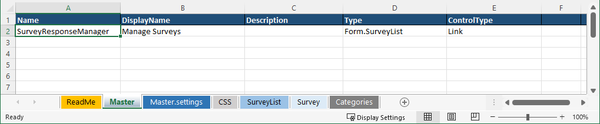

And, we're done!

## Upload DataPortal

To build the DataPortal, simply upload the Excel workbook to Composable. 

To upload the DataPortal model file (Excel Workbook), create a new DataPortal and either click the `Choose File` button, or drag your file over to the upload box.

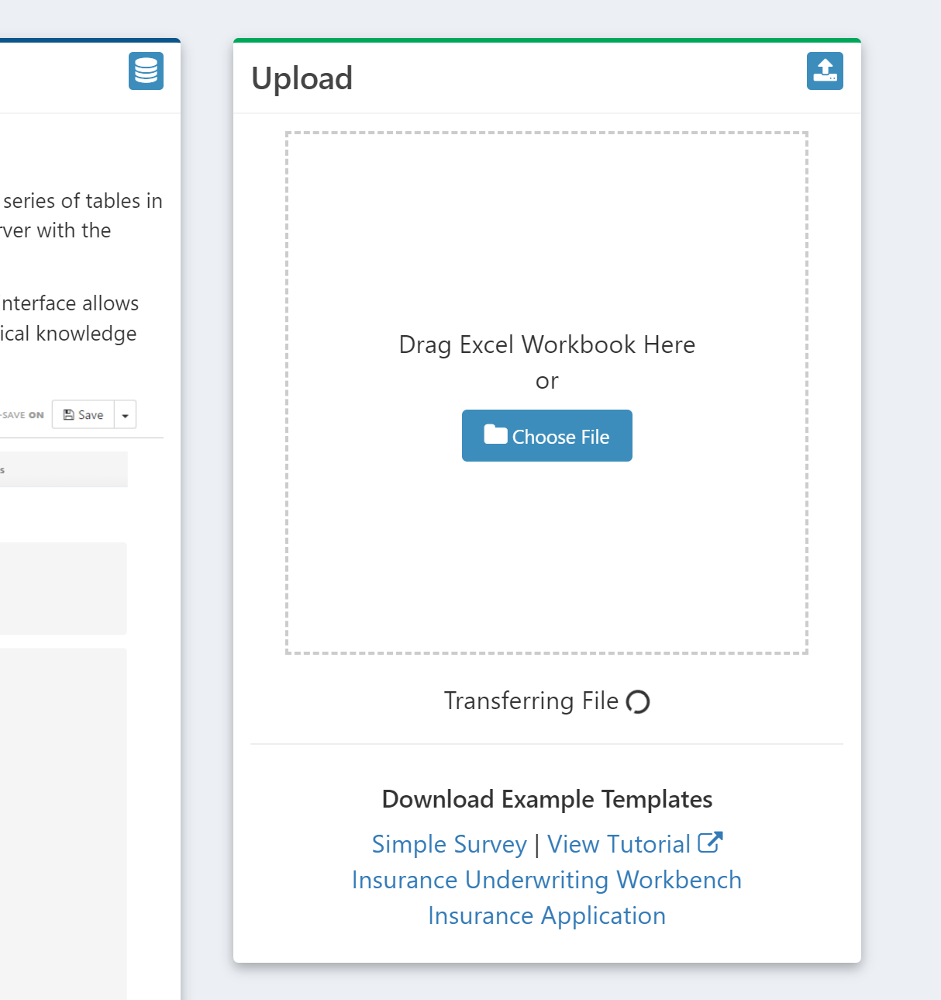

In the background Composable creates your database. Once it's finished processing, click on the `Open DataPortal` button and you'll be brought to the homepage of your DataPortal, which will initially look empty, since there is no survey data yet that has been added.

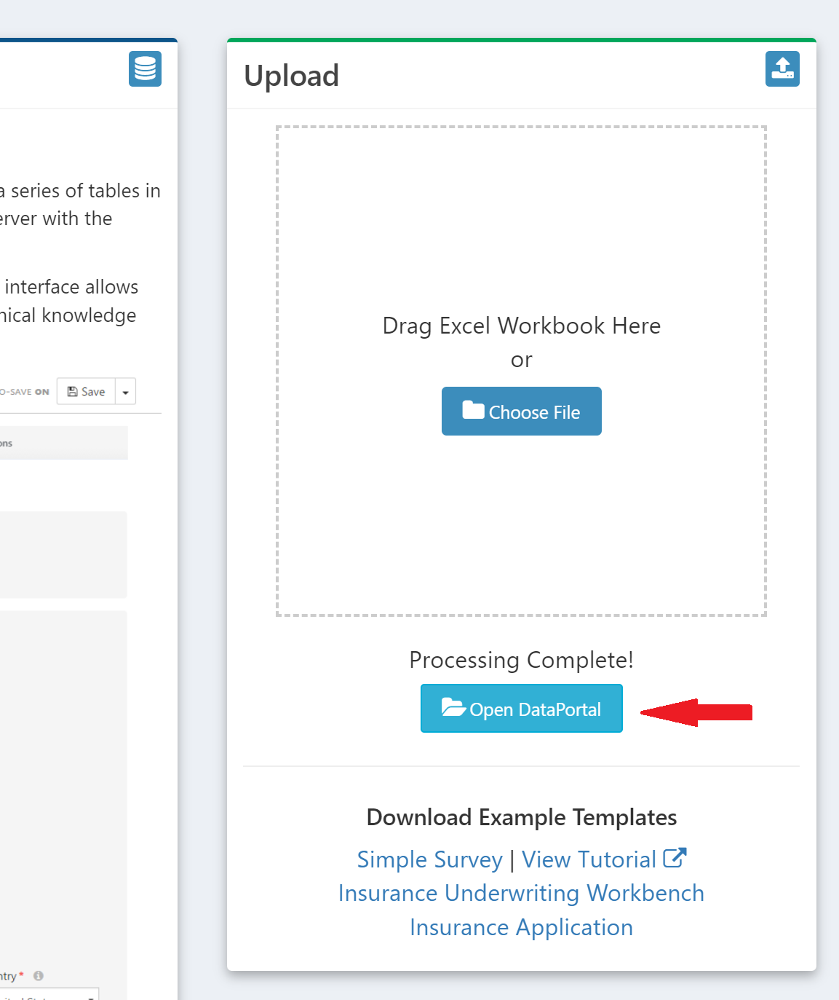

## Survey Data - Web Interface

The initial view of the DataPortal will be the "table of surveys" we defined. We can create a new "survey entry" using the "Create New Survey Entry" button.

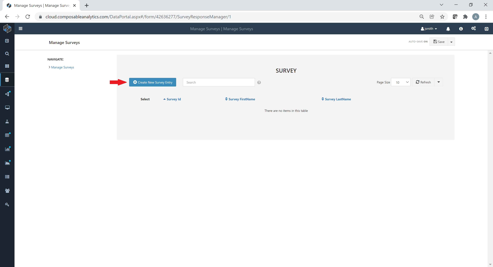

All of the fields we defined are perfectly layed out and our survey is ready for data entry. Our instructions label is nicely formatted, with the given Markdown syntax, each required field is properly designated, and navigation is quick and easy with breadcrumbs.

Composable has provided us with a fully responsive web-based CRUD (Create, Read, Update, Delete) interface that can be used for data entry, without us needing to write a single line of HTML, CSS, or JS code!

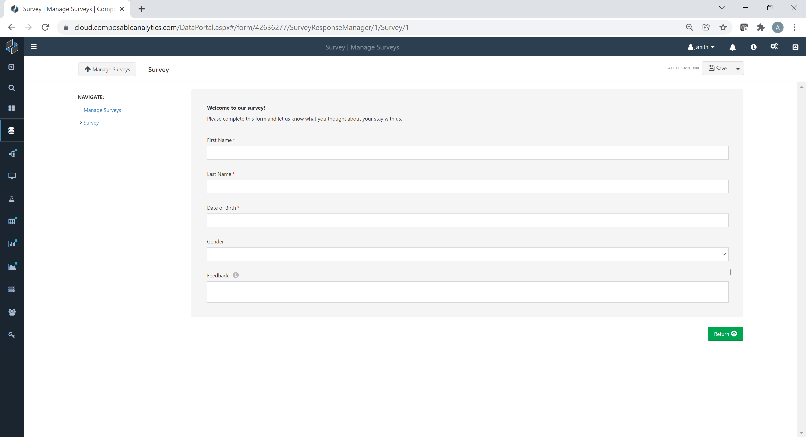

## Exploring the Back-end Database

Now that our front-end is taken care of, let's see what Composable generated under the hood to store our responses. 

We can create a Composable [DataRepository](../DataRepository/01.Overview.md) for our DataPortal to view and query the back-end database directly.

!!!note
    A [DataRepository](../DataRepository/01.Overview.md) can connect directly to a DataPortal id and show you a database diagram with tables connected by primary and foreign keys.

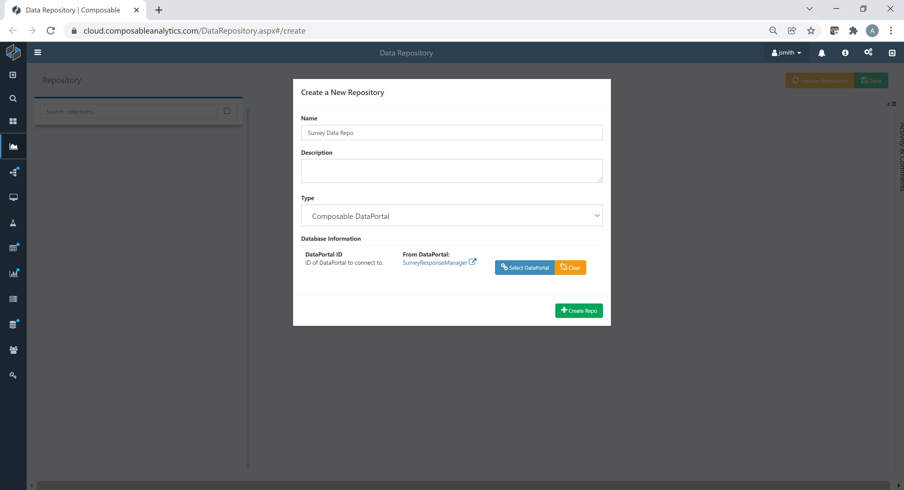

Many of these tables are generated to support things like authentication, access control, and revision history, but you'll be sure to find auto-generated tables to represent the full data model defined in your Excel workbook.

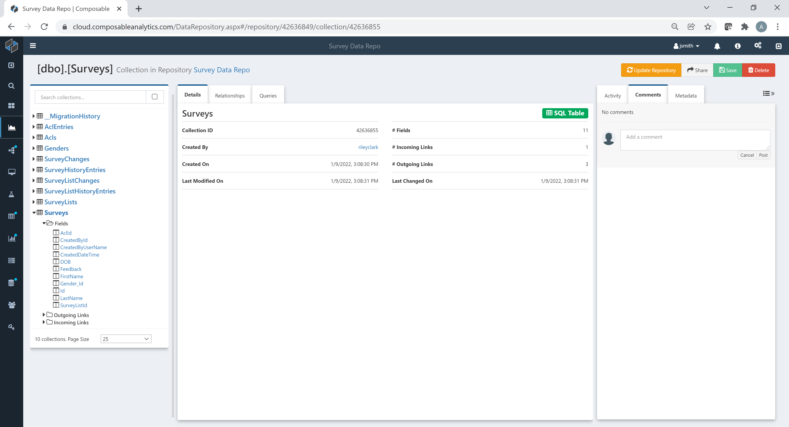

We can also view a visual representation of the relationships (the "entity–relationship model," or ER model) from our [DataRepository](../DataRepository/01.Overview.md).

We can add some sample data using the DataPortals web interface, and query the table in the database. You'll notice that all of the fields you defined are present and strongly typed in the database table. You'll also get some useful metadata, like the user who filled out the survey and when they did so. 

!!!note
    DataPortals provide certain features that automatically protect you from malicious users who would try to corrupt your data

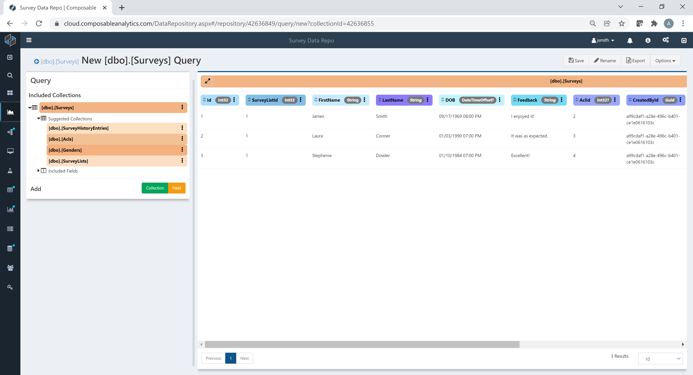

## Next Steps

Just like that, we've gone from scratch to a fully operational data modeling and acquisition application with just a few sheets written in Excel. With a bit more effort, you can create much more powerful forms and data models, like the one below, with complex hierarchies, field grouping, dynamic layouts, nested tabbing, complex validation, and more. And, if you don't like the way it looks, you can change the design yourself. Simply, add an optional sheet called `CSS` and enter custom CSS rules to style the pages with any colors, margins or other custom style behavior.

DataPortals can be also referenced in other Composable product areas. Create [QueryViews](../QueryViews/01.Overview.md) to query the data or Create [DataFlows](../DataFlows/01.Overview.md) that define full analytical workflows utilizing the data.

