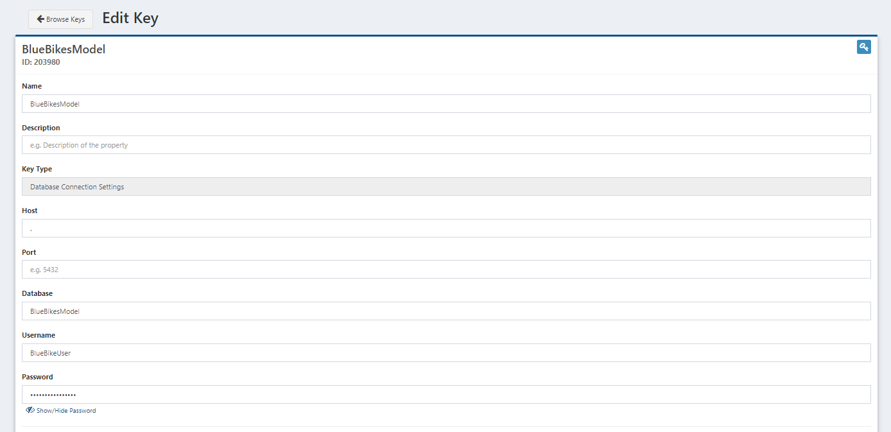
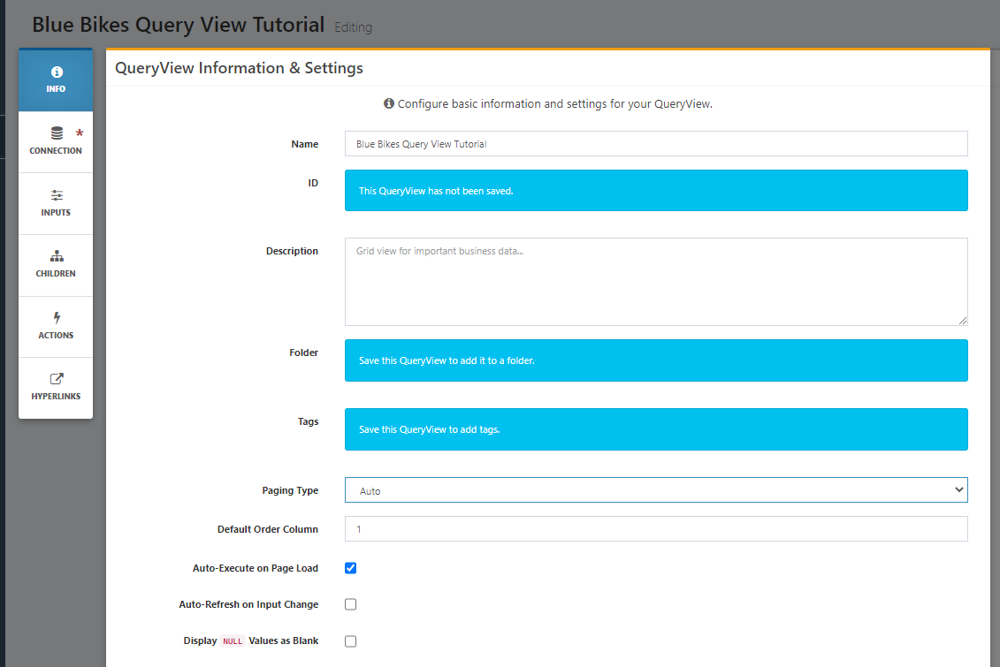
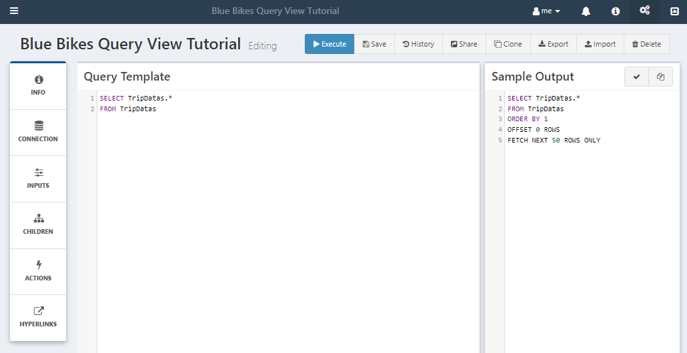
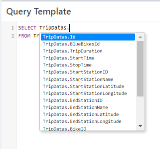
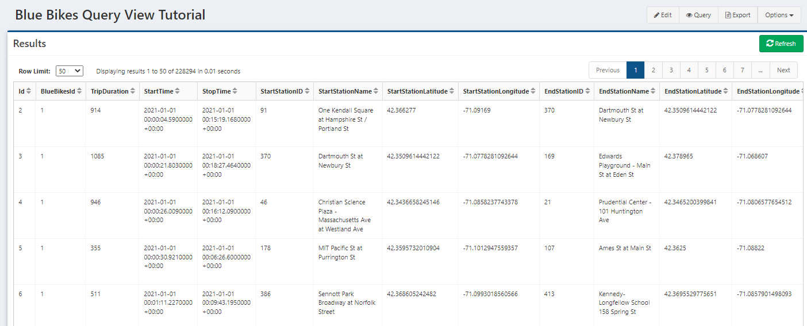
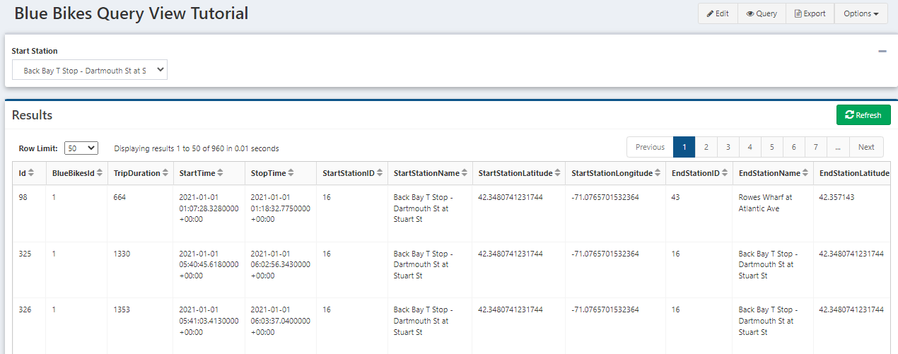
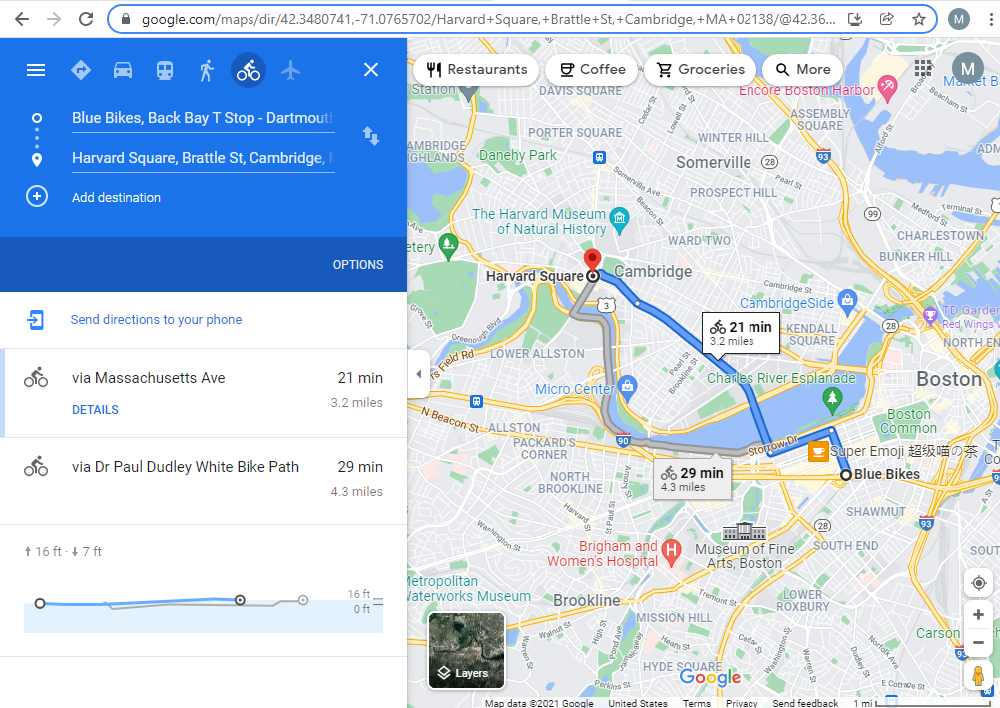
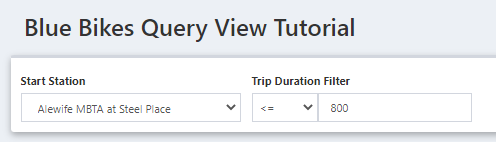
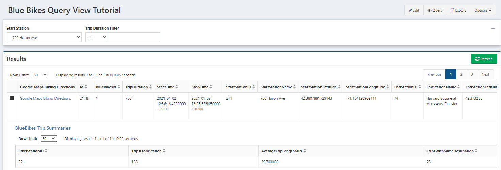

# Creating a QueryView of a DataPortal

QueryViews provide querying and exploration of data stored in a database in an interactive web-based environment. The interactivity features can also be used to connect Composable applications together, such as starting DataFlows with [actions](../QueryViews/Actions.md).

In this tutorial, we will continue the series using BlueBike data, [Reading BlueBikes data](./ReadingBlueBikes.md), then [loaded into a DataPortal](BlueBikesDataPortal.md). Here, we'll view the data we stored in the DataPortal with QueryViews and demonstrate the functionality of QueryViews. QueryViews can be easily used for generating reports where users can apply filters for their use case. 

Here are the json files for the QueryViews created in this tutorial that can be imported into a QueryView as reference.
- <a href="../../Tutorial/img/Blue Bikes Query View Tutorial.json" download="Blue Bikes Query View Tutorial.json">Download Parent QueryView</a>
- <a href="../../Tutorial/img/BlueBikes Trip Summaries.json" download="BlueBikes Trip Summaries.json">Download Child QueryView</a>

!!! note
	When importing these QueryViews from the json files, note that the parent/child relationship is not yet defined as the QueryViews are not linked in the export/import process. The child relationship will need to be defined, as shown below in the "Adding a Child QueryView" section.

## Accessing the Database with a Key

To access any database, you need log-in credentials. When we created the DataPortal, this does not create credentials, so you will need to get in touch with your Composable administrator/DBA to create credentials to access the `BlueBikesModel` Database before continuing.

With your database credentials, you can store them securely in Composable Key Vault as a [Key](../Keys/01.Overview.md).

Go to the `Create New` Keys page, and select `Database Connection Settings` as the `Property Type`.

Then enter the following values into the fields, including the credentials that were set up. Because this is the local Composable instance the `Host` is `.`. If accessing a database on another server, the host is the IP address of the server.

| Field       | Entry                                                        |
| ----------- | ------------------------------------------------------------ |
| Name        | <The name for the Key. This is displayed in Key selection windows\> |
| Description | <Optional description of the key\>                           |
| Host        | .                                                            |
| Database    | BlueBikesModel (name of the DataPortal Database)             |
| Username    | <Your database username\>                                    |
| Password    | <Your database password\>                                    |



Save the Key, and now we can get started on creating a QueryView.

## Querying Trip Data in a QueryView

### Create a New QueryView

Now go to the QueryView menu, and select `Create New`. Start with the `Info` button on the left side panel. Enter a `Name` for the QueryView and change the [`Paging Type`](../QueryViews/Paging.md) to `Auto`. Auto paging will automatically set up paging, but if you want to change the number of rows on a page, you can select `Full`.



Then move to the `Connection` panel. Click the `Select Connection` button to choose the Composable Key with our Database credentials. Now we're connected to the database and ready to start writing the our query. As we write, you will see that autocomplete suggestions will appear with table names/columns and other values from the Database.

Now is a good time to hit the `Save` button in the top right. You cannot run a QueryView if it has not been saved. Make sure you have named your QueryView or else you will get a warning.

### Writing a Query

Go back to the main screen and start creating a query. Our data was loaded into the `TripDatas` table. Going back to the DataPortal tutorial, we named the container `TripData`. The database creation process of a DataPortal will (do its best to) pluralize names. Start with a simple select query. 

```sql
SELECT *
FROM TripDatas
```

As we're typing, the Sample Output section is generating what the final query will look like. The Order By is set by the column selected from the `Info` page, and the paging information is placed after that.



Autocomplete can help with column names. Sometimes you may need to start with `<TableName>.` to bring up the column names from a table.



Press the Execute button and take a look at the results. Here's the data we inserted from the DataPortal along with some monitoring columns that are included in DataPortals.



### Literal Input

Now, lets make the query more interactive by adding literal and filter [Inputs](../QueryViews/Inputs.md). Let's explore the simple idea of looking at trips that started from a specific station. As an aside, a better data structure would be to normalize our table, and just have StartStation/EndStation Ids in this table, with a separate lookup table with the station names and locations. We could use the `current_bluebikes_stations.csv` file from the [BlueBikes data page](https://s3.amazonaws.com/hubway-data/index.html) to do this.

But for now, click the edit button to make changes to the query. Click `Inputs` in the left panel, and select `Add New Literal`. We will add a literal to select between different stations, to view a single station in the data. Notice how we're using a Choice Query. This is a way to implement lookup values, where the actual literal value will be a station ID, but the station name will be displayed to the user while they are selecting.

| Field Name       | Value                                                        |
| ---------------- | ------------------------------------------------------------ |
| Display Name     | Start Station                                                |
| Template Name    | stations                                                     |
| DataType         | Whole Number                                                 |
| Default Value    | (Select a value from the dropdown after entering the Choice Query) |
| Choice Query     | SELECT DISTINCT StartStationID, StartStationName FROM TripDatas |
| Parent Overide   | Only Override with parent data row values                    |
| Position         | Horizontal                                                   |
| Hidden           | unselected                                                   |
| Visible As Child | unselected                                                   |

Save and now add this to the query with a where clause and use the `Template Name` to reference the literal. Notice how the Sample Output fills in the input value with the same data type.

```sql
SELECT *
FROM TripDatas
WHERE StartStationID = {{ stations }}
```

Press the execute button again. At first the results are empty because we didn't set a default value so the literal is blank. But there is now a dropdown of our input field. Select a station, then click the `Refresh` button and see the results change. If you want the results to automatically refresh when you change an input, go to the `Info` panel and select `Auto-Refresh on Input Change`.



### Adding a Hyperlink

Now, let's check out the route that google maps would suggest for each trip in our data. The url format for this is `www.google.com/maps/dir/<start>/<end location>/data=!4m2!4m1!3e1`. The data section at the end gives us the directions via bike, taken from this [Google Maps Help forum](https://support.google.com/maps/forum/AAAAQuUrST84CiQTcarJHk/?hl=en&msgid=freuulMVFH0J&gpf=d/msg/maps/4CiQTcarJHk/freuulMVFH0J)

We will create a hyperlink that will appear next to each row of the data. Click on `Hyperlinks` in the left panel, and then `Add New`. 

| Field Name    | Value                                                        |
| ------------- | ------------------------------------------------------------ |
| Name          | Google Maps Biking Directions                                |
| Default Link  | (unselected)                                                 |
| Link Template | `https://www.google.com/maps/dir/{{StartStationLatitude}},{{StartStationLongitude}}/{{EndStationLatitude}},{{EndStationLongitude}}/data=!4m2!4m1!3e1` |

!!! note
	Make sure to put `https://` at the beginning of your url or else your url will try to navigate within your Composable application url

Run the query again, and try clicking on the link. That's a possible route of the trip!



### Adding a Filter

The literal we just made could have also been a filter. Let's add a filter based on TripDuration if we want to see shorter or longer trips.

| Field Name             | Value                                     |
| ---------------------- | ----------------------------------------- |
| Display Name           | Trip Duration Filter                      |
| Template Name          | DurationInput                             |
| DataType               | Whole Number                              |
| Default Value          | (blank)                                   |
| Choices Query          | (blank)                                   |
| Multi-Choice           | Unselected                                |
| Parent Override        | Only override with parent data row values |
| Position               | Horizontal                                |
| Hidden                 | unselected                                |
| Visible as Child       | unselected                                |
| Search Type            | Single-Column Search                      |
| Column                 |                                           |
| Default Operator       | <=                                        |
| Allow Operator Changes | Checked                                   |

We left the default value blank here. If there is no input on a filter, it will not be applied to the query so the query can still run.

Now add the filter to the query, right after the stations input. Look at the sample output and see that the `AND` is included with the filter.

```
SELECT *
FROM TripDatas
WHERE StartStationID = {{ stations }} {{ DurationInput }}
```

Execute the query and try out the functionality of the filter.



### Adding a Child QueryView

Child QueryViews provide an interface to add additional information on a row, by being able to reference additional data and base it on values in a data row. Here, we'll make a child query that show summary statistics for trips taken from the same station. These results will be a single row, but you can also add a full query, such as bringing up all trips with the same start and end stations.

We will first create the child QueryView, and then link it to the QueryView we have created.

Like we did before, create a new query, name it, switch paging to `Auto` and add the key to the connection.

Next we can write the query, including values such as the number of trips that left same start station as the parent query start station, the average length of trips from this station, number of trips that have the same destination, and number of unique bikes that have departed from the station.

```sql
SELECT
StartStationID,
COUNT(*) AS TripsFromStation,
AVG(TripDuration)/60. as AverageTripLengthMIN,
SUM(CASE WHEN 1=1 {{ parentendstation }} THEN 1 END) AS TripsWithSameDestination,
COUNT(DISTINCT BikeID) AS DistinctBikesVisited
FROM TripDatas
WHERE 1=1 {{ parentstartstation }}
GROUP BY StartStationID
```

Next we define the input values as filters. Since we want the values to come from the parent query, the `Display Name` of our input must match the column names of the fields we want them to use the values from, `StartStationID` and `EndStationID`. One of them is defined in the following table

| Field Name      | Value                |
| --------------- | -------------------- |
| Display Name    | StartStationID       |
| Template Name   | parentstartstation   |
| DataType        | Whole Number         |
| Search Type     | Single-Column Search |
| Column          | StartStationID       |
| DefaultOperator | =                    |

Save and navigate back to the parent QueryView.

Select Children in the left panel, click `Add New` and search for the QueryView we just created. Select it and click the `Select Resource` button at the bottom of the window. Then check out the results after executing. The child query results if we had entered the parent query values as the inputs of the child query.



## Next Steps

QueryViews are great for reporting and sharing with users. The interactive features allow action directly from the results page. [Actions](../QueryViews/Actions.md) can also connect QueryViews result data to DataFlows. Check out the documentation page for an example on use.
