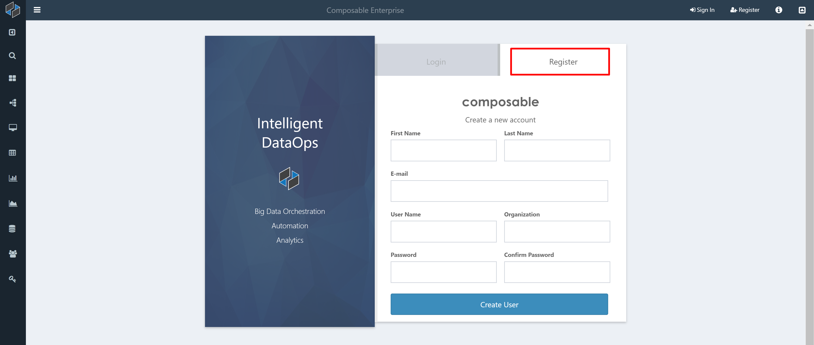

# Overview

Composable DataOps Platform is a multi-user collaborative system. Collaboration is a key factor in the way users create methods and understand their results. Composable provides a strong, granular security model that allows users to share their methods and results with other users.

Users and Groups are two core entities within the platform that are considered securable resources and have various access control permissions that can be applied to the individual resources. Groups serve as a way of managing permissions for a large number of users.

## Users

Users create accounts in a similar fashion to any other website. The typical [registration workflow](../Composable-Platform/02.Navigation.md) steps include:

- User creates an account through a web form
- Email is sent to user ensuring a valid email exists
- The user clicks on a verification link in the email
- An email is sent to an authoritative person to accept or reject pending the account
- If the account is accepted, then the account is enabled
- Email is sent to the user letting them know the account is active

### Main User DashBoard

Every User in Composable starts out with a single auto-generated DashBoard that serves as their Main DashBoard. (Users can of course create additional DashBoards as needed.) The Main DashBoard functions and is stored exactly like any other DashBoard in the system; however, when a user logs on, the user is redirected to the Main DashBoard. Individuals can customize their own DashBoard, and can share this like any other DashBoard. By default, the Main DashBoard displays live elements for favorite DashBoards, Groups, and DataFlow Applications. Other default live elements include newly created and highest rated DataFlow Applications. Users can post results to the Main DashBoard, and use it as their launching pad to their most used Composable resources.

### User Profile

Each User in Composable has a [User Profile](./02.User-Profile.md) page, where they can update basic information, change their password, select a theme, generate API authorization tokens, and perform other tasks. This is outlined in the [User Profile](./02.User-Profile.md) page.

## Groups

A collection of Users that share a common role, or permissions, can be placed in a Group. Groups aide in securing other resources within the system. Rather than giving permissions at the individual user level, permissions can be specified at the group level. For example, if you want to give only certain people write permissions to a resource, you can create a Group, assign the Group write permissions to the resource, and then add Users to the group.

Users can be added to the Group by the owner, and also by any User or any other Group, with write access to the Group. Users can also request to join a Group. Group owners are sent an email when a join request is created, and owners have the option to accept or reject it.