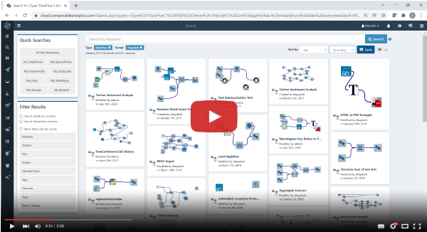
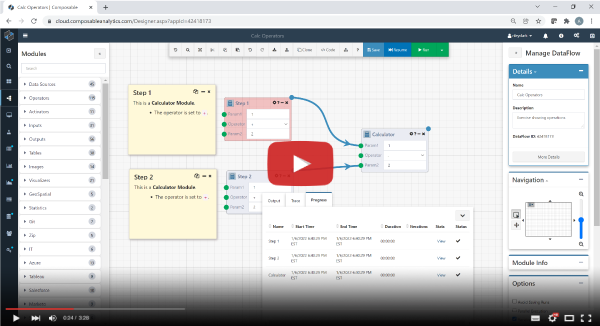
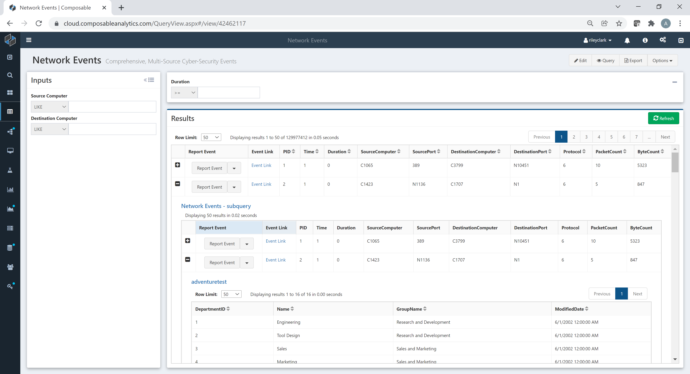
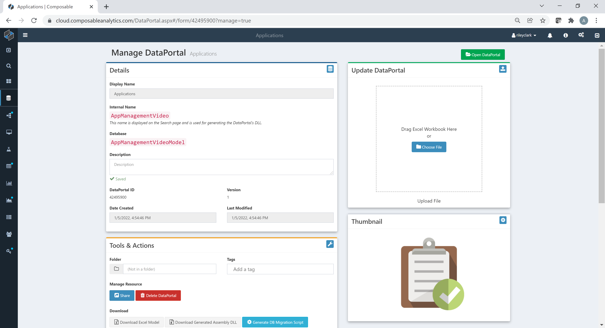
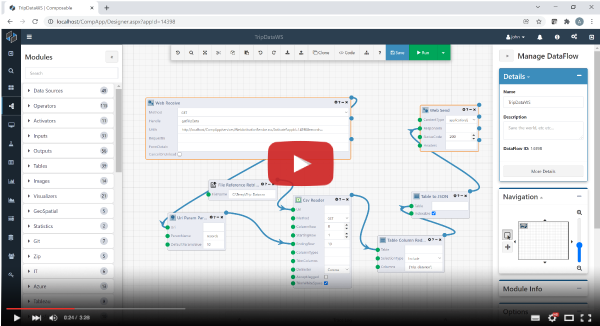
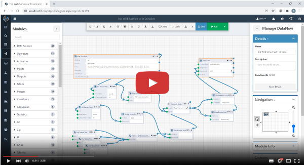
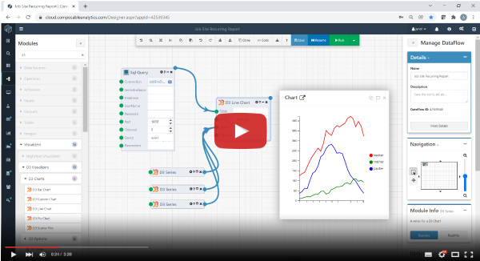

# Video Tutorials

## Basic Navigation within the Composable DataOps Platform

This video covers user registration and login, as well as basic navigation across the Composable DataOps Platform.

## Introduction to Composable DataFlows

This video provides an introduction to Composable DataFlow Applications. A simple DataFlow is used to demonstrate the functional areas of the Designer, as well as how to Create, Run, Resume, and Share DataFlows.

## Introduction to Composable QueryViews

This video provides an introduction to creating a new Composable QueryView, to page through a large data set and create a dynamic filter on the resulting live data grid.

## Introduction to Composable DataPortals

This video provides an introduction to Composable DataPortals, with additional context on when and how to use DataPortals for data modeling.

## Building Web Services with Composable DataFlows (Part 1)

This video explains why and how to use Composable DataFlows as web services. A simple web service is demonstrated that allows users to request a specified number of records from a NYC taxi trip dataset.

")

## Building Web Services with Composable DataFlows (Part 2)

This video demonstrates further builds on using DataFlows as web services, and specifically demonstrates how to use the Clone and nested dataflow functionaility to introduce dynamic routing.

")

## Automating Recurring Reports with Composable DataFlows

This video demonstrates how to quickly author a DataFlow to create an automated recurring report. The example report consists of a line chart as well as an attached Excel file.

