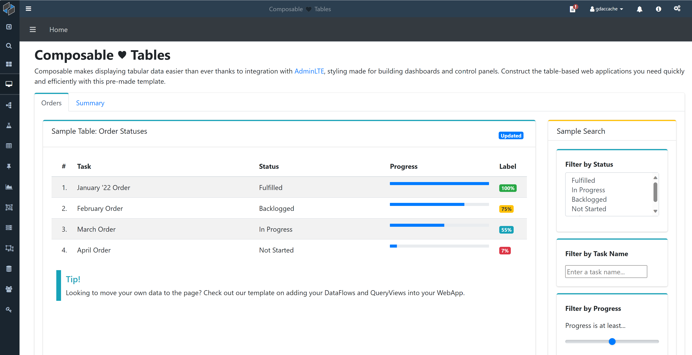

# Overview

Composable WebApps is a full-stack web application development resource built into the Composable DataOps Platform. It allows users to quickly build and import web applications, as well as fully integrate them with resources from other areas of the Composable platform.

WebApps is designed with flexibility in mind, meaning it is just as well-suited for quick, single-page applications as it is for industrial-grade, production enterprise applications. Likewise, WebApps allows for as much or as little customization as desired, from zero-code solutions using Composable's pre-made templates to tailor-made apps built entirely by the user. It also enables users to directly import existing applications, even ones built using a web application framework such as Angular.

## Introduction
Composable is at its heart a platform founded on extensibility, and WebApps serves this ethos in two key ways. First, WebApps provides users with the ability to host fully custom web applications inside a Composable instance, providing a way to host and display the content of their choosing. Second, WebApps' front-end interfaces can leverage existing Composable resources, such as web services, custom DataFlow-backed service endpoints, and parameterized QueryViews with minimal code and configuration. This empowers users to spin up web applications without the hassle of developing or configuring a backend server/middleware — instead, existing Composable resources are the microservices and API endpoints.

On top of that, deploying as a Composable WebApp comes with user authentication and fine-grained role-based access control (RBAC) for free, built right into the Composable platform.

The following sections walk through how to get the most out of a Composable WebApp, beginning with how to [create a new WebApp](./02.WebApp-Create-New.md) and how to use the [WebApp editor](./03.WebApp-Editor.md). Later sections cover some of the more advanced capabilities such as [templates](./04.WebApp-Templates.md) and using [build tools](./06.WebApp-Build-Tools.md).
