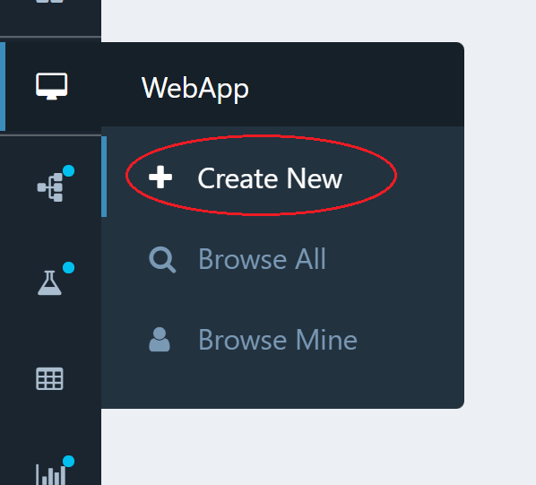
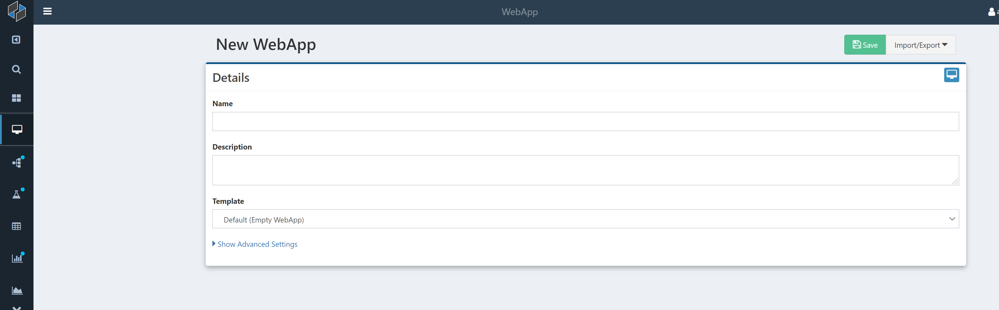
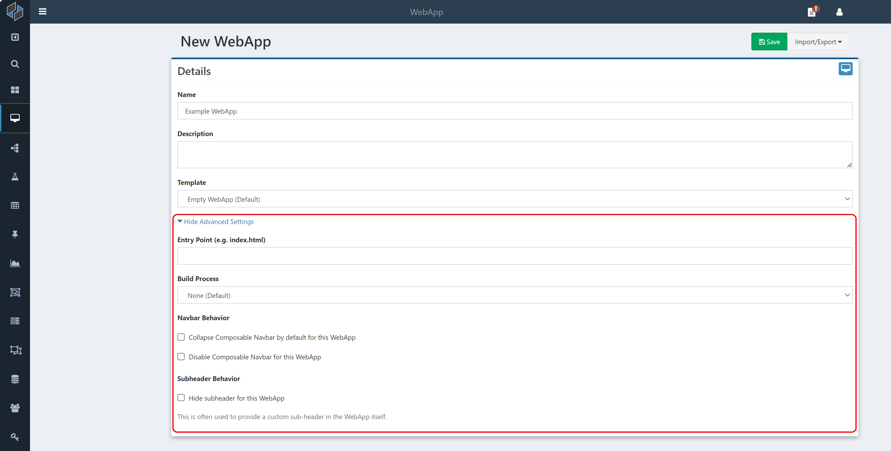
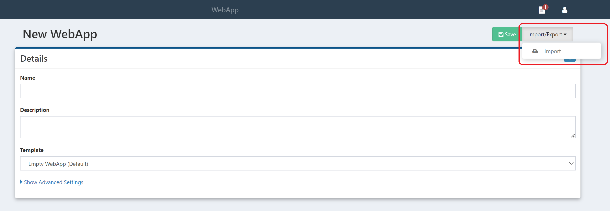
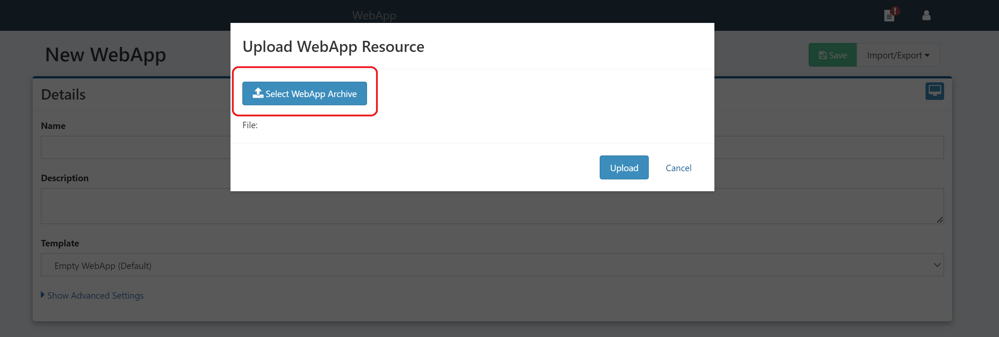
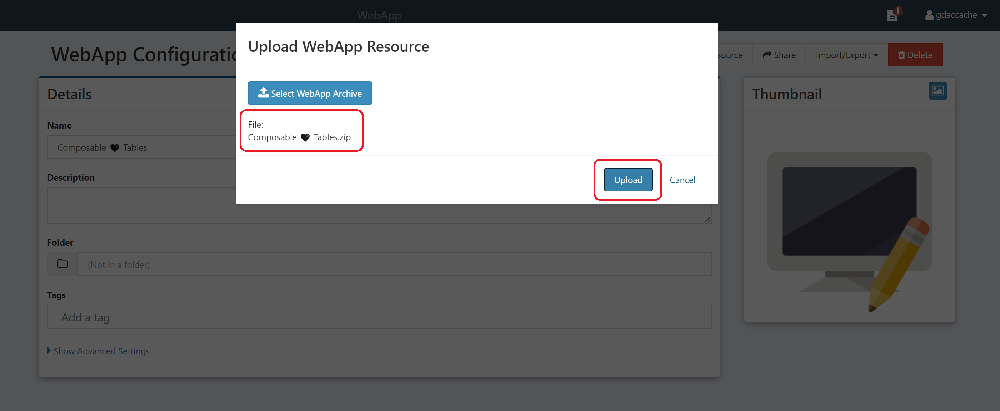
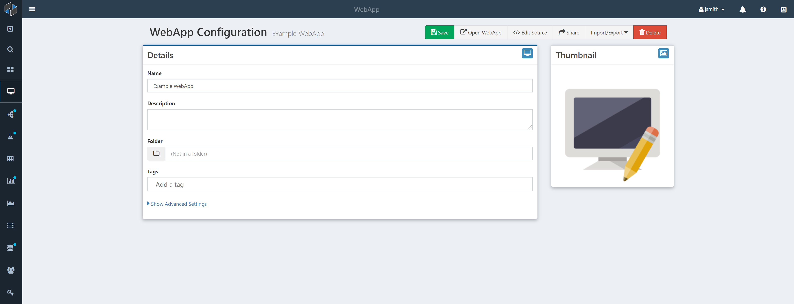

# Creating a New WebApp

To create a new WebApp, simply click on the WebApp icon in the side navigation bar, or hover over the icon and click the `Create New` link that appears.

You will be presented with a simple configuration screen for the new WebApp.

From here, there are three main ways to create a WebApp: from scratch, from a template, or from an import. The sections below cover each of these methods in turn.

## From Scratch

To create a new, fully blank WebApp, simply provide:

* **Name**: The name for the new WebApp
* **Description**: (optional) free-form text that describes the WebApp

The **Template** field is initially set to "Empty WebApp (Default)" and does not need to be changed.

While a name is all that is needed to create a WebApp from scratch, WebApps are additionally configurable through the `Advanced Settings` accordion:

* **Entry Point**: The home page for the WebApp. Provide the path to a specific page here to direct entry to that page when the WebApp is opened. The default is the main page (e.g. index.html).
* **Build Process**: To develop a web application using a front-end framework such as Angular, select the build process corresponding to the desired framework from the dropdown. By default, WebApps are created with vanilla HTML, CSS, and JavaScript and do not require a special build process to display its contents.
* **Navbar Behavior**: Select the first checkbox to automatically collapse (hide) the Composable side and top navigation bars. The bars will only appear when the expand button on the top right of the page is clicked. To completely prevent the Composable navigation bars from appearing, select the second checkbox instead.
* **Subheader Behavior**: Select this to hide any custom sub-headers that may be set on the Composable instance.

## From a Template

Often it can be helpful to start with an existing web application and adapt it to a given use case. For this reason, Composable provides a number of templates to build upon or to use with custom data. To create a WebApp following a pre-made template, follow the above process while selecting one of the available templates from the **Template** dropdown:
* **Composable Tables (AdminLTE)**: This WebApp comes with [AdminLTE 3](https://adminlte.io/), a design framework built from Bootstrap that is ideal for dashboards, admin panels, and table-heavy web pages. The template provides a purpose-built multi-page dashboard with the most popular functionalities from AdminLTE.
* **D3**: This WebApp integrates the popular tool [D3.JS](https://d3js.org/), a JavaScript library built for dynamic, interactive data visualizations. It includes a guide on how to use data from DataFlows and QueryViews to populate a variety of plots, graphs, and charts.
* **DataFlows and QueryViews**: Similar to the previous template, this sample WebApp includes a pre-built navigation bar and main page with all the functionality needed to display results from DataFlows and QueryViews - just input the ID!
* **Routing**: Best suited for larger applications, this template avoids the hassle of building a routing system to navigate between pages of a WebApp by including a horizontal navigation bar as well as four pages to fill.

Further information on how to use each of these templates, as well as examples, are provided in [WebApp templates](./04.WebApp-Templates.md).

## From an Imported File

To import an existing WebApp, first select the `Import/Export` button from the top right of the page, then click `Import`.

From the popup that appears, use the `Select WebApp Archive` button to open a file picker.

The WebApp should be a .zip file (a compressed folder) containing a source file as well as an interface.json file. Since this is the format resulting from exporting a WebApp, there is no need to modify an exported WebApp before importing it.

After selecting a WebApp through the file picker, the popup will display the folder name. Click the "Upload" button on the bottom right to finish importing the WebApp.

# Saving the WebApp

Regardless of the method used, to finish creating the WebApp, save the settings just provided by clicking the green `Save` button on the top left corner of the page. Once saved, the WebApp is immediately created and the page shifts to the configuration screen.

On this screen, the user can update any previously set settings (e.g., Name, Description, Advanced Settings), place the WebApp in a Folder, and label it with Tags. The screen also allows the user to set a thumbnail for the WebApp by clicking on the thumbnail image, which will then be shown on the Search page. As with other securable resources (DataFlows, QueryViews, etc.), a `Share` button is available that allows for assigning permissions for this WebApp to other Users and Groups.

Finally, the configuration screen comes with two buttons on the top right for:

* `Open WebApp`: This will open up the WebApp in its own tab
* `Edit Source`: This will open up a [web-based editor](./03.WebApp-Editor.md) to edit the WebApp's source code files (e.g., html, css, js, etc.)

!!!note
    While, in general, all "Securable Resources" (e.g., DataFlows, QueryViews, etc.) created by a user are initially private, with permissions able to be [granted](../Composable-Platform/05.System-Administration.md), WebApps are, by design, viewable by other users.
