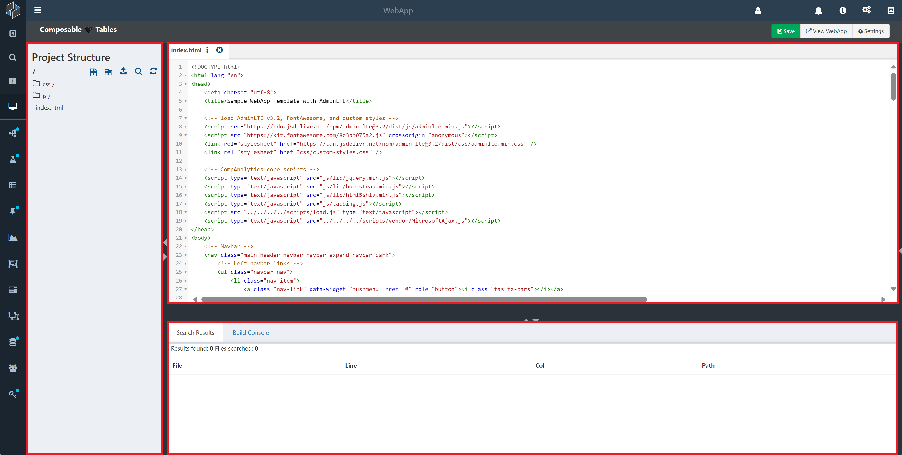
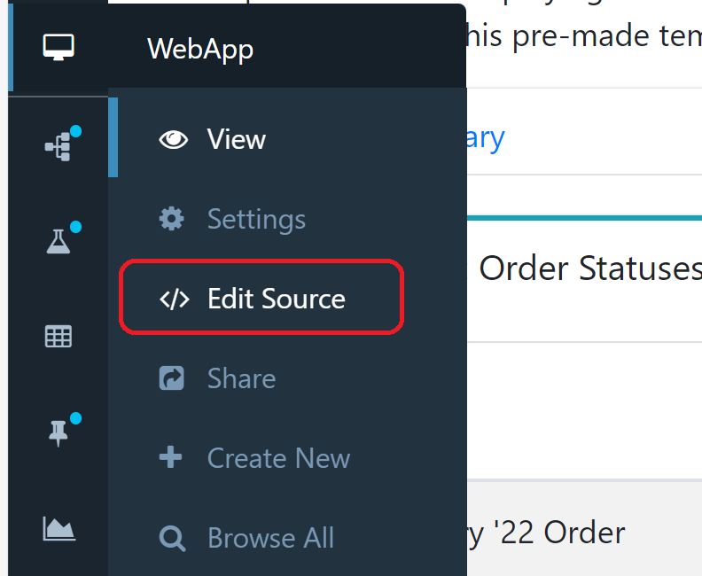
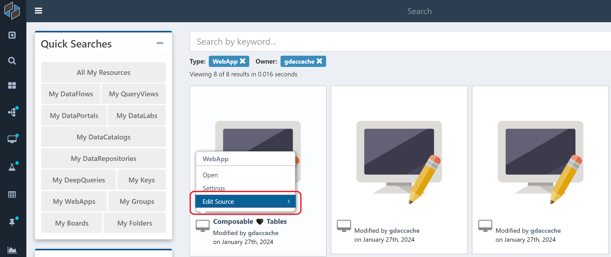
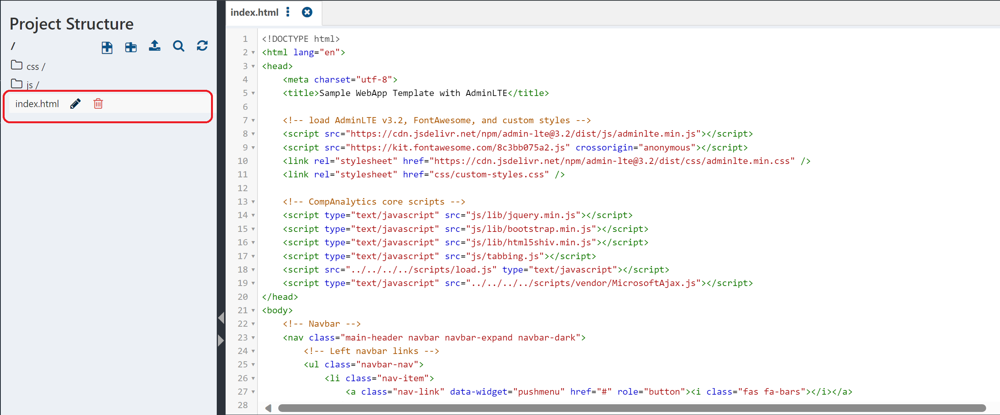
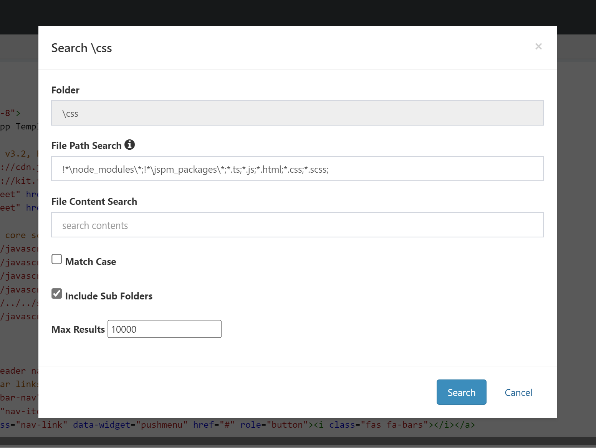
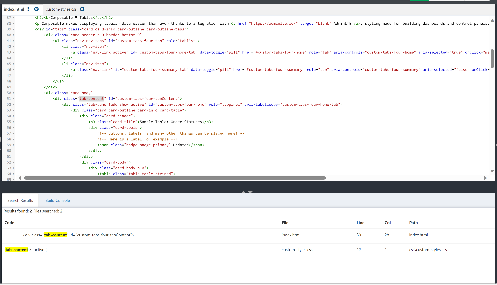

# Editing a WebApp

Composable provides a full web-based development environment for creating and editing WebApps. This page covers the ins and outs of the editor's layout and features, as well as tips for streamlining the development process.

!!! note
    Some parts of the editor are only visible for WebApps which use a build process. Those build-specific features are covered in depth in the [build tools](./06.WebApp-Build-Tools.md) page.

The editor is composed of three main parts, outlined in red: the project structure panel, the search results panel, and the code panel.

## Accessing the Editor
To access the editor directly from a WebApp, hover over the WebApp icon in the sidebar and click on `Edit Source`.

It is also possible to directly reach the editor from the search page by hovering over the WebApp to edit and selecting `Edit Source`.

## The Project Structure Panel
The left side of the editor is known as the project structure panel and is designed to function as the root folder of the project, denoted by a `\` at the top. It provides a tree view of the files that make up the WebApp.

Regardless of the template chosen, all WebApps initially contain an `index.html` file which serves as the main page. Clicking on the name of a file will open it in the code panel. Likewise, clicking a folder will display its contents.

Similar to file explorers on an operating system, the buttons on the top of the panel (and those which appear when hovering over a folder or file) allow for common management tasks, including:

* Adding new text files and sub-directories
* Uploading a wide range of files, including images and folders
* Searching the entire project or a specific folder
* Refreshing the panel
* Renaming files and directories
* Deleting resources

Hovering over an icon displays its function.

## The Search Results Panel
This panel is situated at the bottom of the editor. As its name suggests, results from searching a directory in the project structure panel will appear here. To see the search results, first hover over the directory to search and click the magnifying glass icon that appears.

The search dialog that appears has several options. File Path Search allows users to select the types of files (by file extension) to search for in the folder, and similarly File Content Search allows users to search for files containing a specific search term. To search for multiple file types or keywords, list the terms using a comma or semicolon to separate each item.

!!! note
    To search for all file types, replace the value of File Path Search with `*.*` - it is advised, however, to keep the first two filters `!*\node_modules\*;!*\jspm_packages\*;` unless explicitly intending to search NPM and JSPM packages.
    
The search dialog also includes options to enable case-sensitive search, search sub-folders of the given folder, and limit the number of search results. Once satisfied with the settings, click `Search` on the bottom right to show the search results in the bottom panel. In the example above, searching the term "tab-content" across the entire project returns two files, each with one result.

Clicking on a result in the panel will open the file in the code panel and highlight the term in gray.

## The Code Panel

The main part of the WebApp editor is dedicated to the code panel, a high performance UI for modifying the code that comprises the WebApp. Among its many features, the code panel provides:

* Basic editor features, such as cut, copy, and paste functionality
* Search and replace, accessed by pressing Ctrl-F (Command-F on Mac)
* File downloading, by clicking the three vertical dots next to an open file's name.
* Automatic syntax highlighting for various languages
* Live syntax checking
* Multi-file editing
* Image rendering

To use the code panel, select a file to edit from the project structure panel on the left. If another file is already open in the code panel, the panel will create a new tab to switch between the open files. 

!!! note
    After editing, don't forget to press `Save` on the top right to make the changes permanent. To view the saved changes at any time, select `View WebApp` to open the WebApp.
