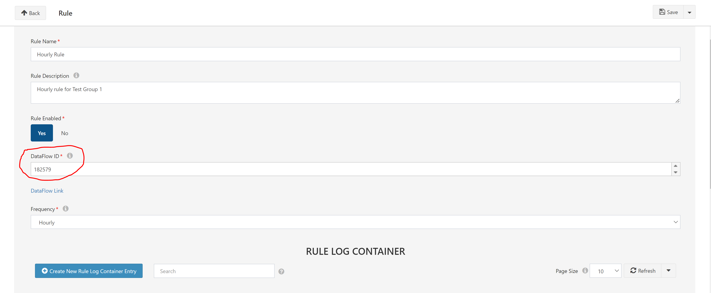
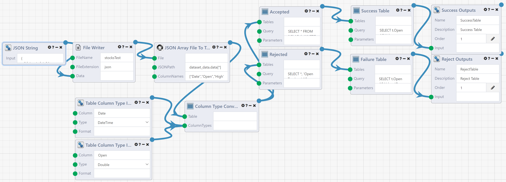
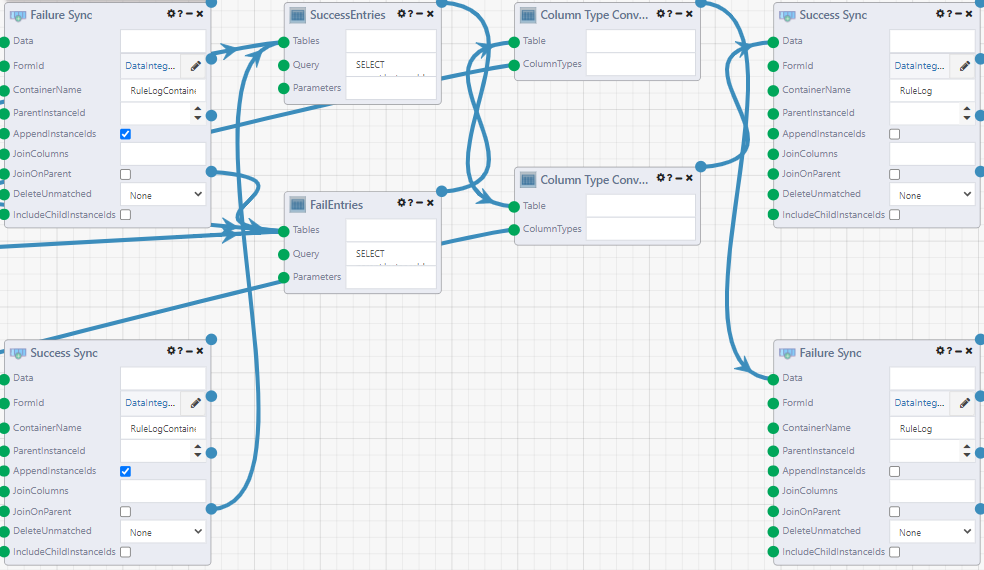

# Full Stack WebApp Tutorial: DataIntegrity Workbench
Welcome! This tutorial will help you build a full-stack WebApp in Composable. The following <a href = "https://raw.githubusercontent.com/ComposableAnalytics/Docs/master/docs/WebApps/files/DataIntegrityWorkbenchFiles.zip" download>zip file</a> contains all the files you will need to build this example.
## Table of Contents
1. [DataPortal](#DIPortal)
2. [DataFlows](#DIFlow)
3. [QueryViews](#DIQuery)
4. [WebApp](#DIApp)
## 1. DataPortal

The next step to creating this application is to create your data source. The Excel sheet for creating the proper DataPortal is attached in the files. Simply create a new DataPortal with it and you may edit entries as you see fit. Start by creating a Group, then make a rule entry. Note that you will need to give it a DataFlow ID. This is the ID of the DataFlow for the rule you want run. More information can be found in the [DataFlow](#DIFlow) section. Rules can be set to run at different frequencies, and you can have one DataFlow registered multiple times if you want differing frequencies. The possible options are:
* Hourly
* Daily (Select an hour 1-23)
* Weekly (Select day of the week (Sun-Sat) and hour 1-23)
* Monthly (Select day of month and hour. Note if you select a day that falls outside the month, the rule will simply be run on the last valid day of the month)
* First Week (Choose day of the week (Sun-Sat) and hour 1-23)
* Last Week (Choose day of the week (Sun-Sat) and hour 1-23)

When a rule is run, a RuleLogContainer will be created from the resulting output. Within these containers there will be individual entries showing which pieces of data passed/failed.

## 2. DataFlows
Every rule you want executed must be a Composable DataFlow. Three example DataFlows can be found in the zip file. `DIRule1` and `DIRule2` are example flows representing rules, and `DataIntegrityMasterFlow` is the main controller that determines when rules get run. These can be imported and saved, and the resulting ID's of the rules can be copied and used in Rule Entries in the [DataPortal](#DIPortal).

### Rules:

The general format for a rule will be `Data Intake` -> `Data Integrity Validation` -> `Data Outputs`. Data intake can be any source of data, these examples simply use a pre-written JSON file. Every rule will output a table for successful entries, and a table for failed entries. These tables consist of a Value and Message, both of which are VARCHARs. These tables can be constructed however the developer wants, and the resulting entries are written to the DataPortal for every run in a timestamped RuleLogContainer. For example, you can have multiple rules executed and then merge the success and failure results in one dataflow.

### Master DataFlow:

Begin with importing the `DataIntegrityMasterFlow.json` file. You must manually set the DataPortalId values of the 5 DataPortal modules in the flow. Make sure the timer is enabled, and then save. This flow handles the running of all the DIRules in the DataPortal, and handles writing RuleLogs back into the portal.
It is advised you **never manually run this flow**. It runs every hour by itself. A code module handles checking each rule's time information to determine if it should be run.

## 3. QueryViews
The last step before we have a fully functional WebApp is the QueryViews that will populate it. In this example, there are 4 QueryViews that need to be imported and linked to the DataPortal's database. The key to the DataPortal database must be given by an administrator. While this example relies on QueryViews, another option is to use the DataPortal Query module in a DataFlow.

## 4. WebApp
The final step is to import the files from the WebApp zip. You can try importing the zip when creating a new WebApp, but if this does not work, you can manually upload the files to the source editor once you create the new WebApp.
### How it works:
This example uses AngularJS to perform UI-Routing. This allows the WebApp to mimic the structure of the DataPortal, and allows a user to share a link and be taken to the exact entry. This is also how information is passed between pages. This is the current recommended way to create a WebApp in Composable. The index.html page contains a `<ui-view>` tag that holds the main pages located in the `templates` directory. The `main.js` file is responsible for registering these sub-pages in the routing module. Each of these sub-pages has an individual JavaScript file with the same name responsible for controlling the page. These files use a Composable API to run QueryViews and pass in parameters. For example when you click on a DataGroup, the ID will be passed to the routing parameters in the URL and will be executed in the DIRules QueryView upon loading the DIRules page.
