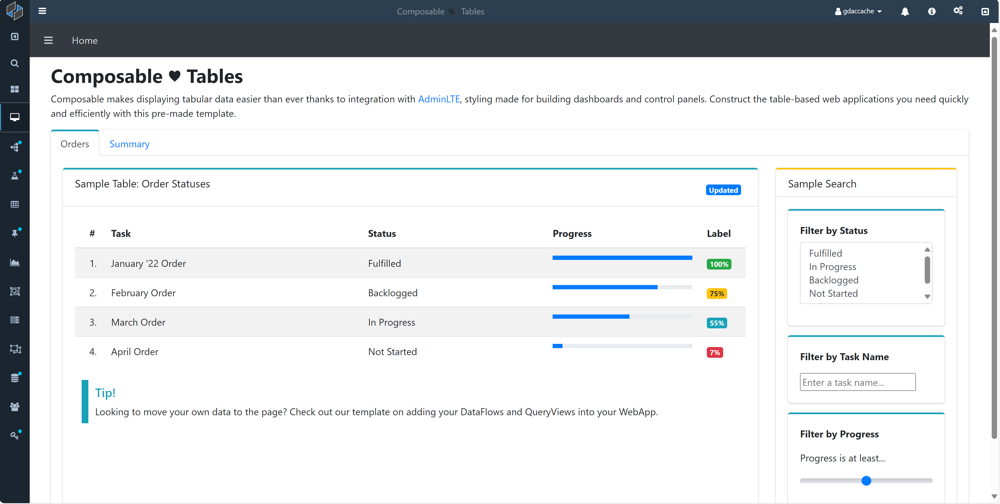
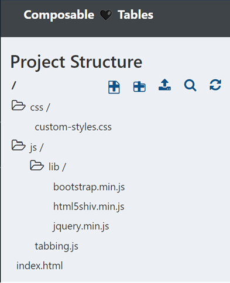
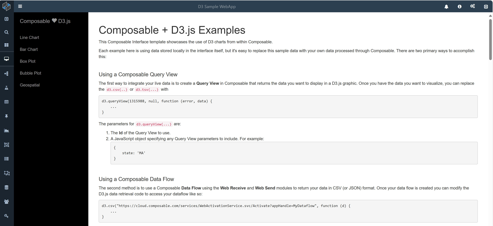
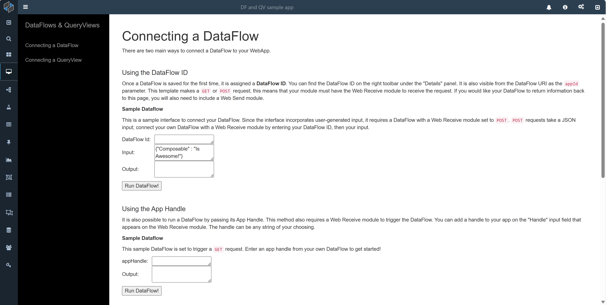
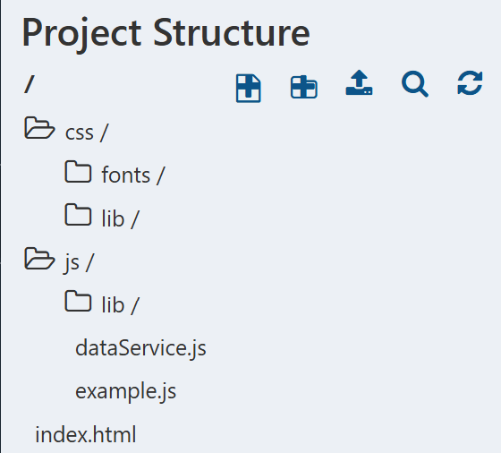
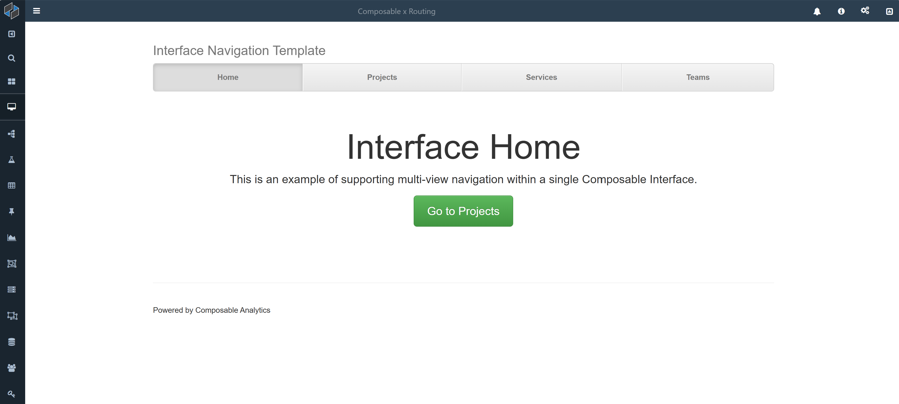

Composable provides a set of templates designed to get WebApps out of the coding pen and into production as seamlessly as possible, reducing overhead for developers. Templates are also useful as a starting point for more specialized WebApps, removing much of the hassle of designing and implementing the structure of a multi-page application. And just as every use case is unique, different templates are best suited for different uses, even as they are all infinitely customizable. This page is dedicated to providing an overview of each template, its structure, and its potential uses to help choose the best template for the task at hand.

# Composable Tables (AdminLTE)

As the name suggests, the Composable Tables template is primarily intended for table-heavy applications, such as dashboards, aggregators, and trackers, or for situations involving a continually updated feed of items, such as order lists, patient applications, or retirement funds. But it is also ideal more broadly for any application using Bootstrap or AdminLTE styling and comes with a well-developed style sheet for that purpose. The WebApp is a single page with two tabs: in our case using the example of an order dashboard, the tabs are labeled "Orders" and "Summary". This allows for displaying both granular and summary data without cluttering the overall WebApp. The template also provides filtering and search functionality for the table, which automatically adapts to your data source.

From [the WebApp editor](./03-WebApp-Editor.md), we see the structure of this template:

`index.html` is the entry point into the application and contains its content and structure, while separate folders for CSS and JavaScript provide custom styling (in `custom-styles.css`) and functionality (in the JavaScript folder). Users may add their own styling or scripts by creating new files and importing them into `index.html`; users may also choose to directly modify the existing stylesheet to customize the look of their application.

# D3

Composable's D3 template integrates your applications with [D3.JS](https://d3js.org/), a JavaScript library built for dynamic, interactive data visualizations. The template content itself is instructional and guides users on how to include common charts and maps in your WebApp, such as line charts, bar charts, box plots, bubble plots, and geospatial chloropleths. The template also includes a guide on how to use data from DataFlows and QueryViews to populate your figures with custom data.

Users building data-intensive applications or focusing on data visualization will find this template particularly useful, as will users who work with constantly changing datasets. The integration with DataFlows and QueryViews also allows users to directly pull from the most recently available data so that their applications remain up-to-date. As in the previous template, the project is divided into the `index.html` entrypoint as well as two folders for CSS and JavaScript. However, this template also contains a Data folder for users to store static datasets for use in visualizations. The provides an alternative method for adding data to your application without existing DataFlows or QueryViews.

# DataFlows and QueryViews

A cousin of the D3 template, the DataFlows and QueryViews template focuses in on integrating other Composable resources into their WebApp. As such, it is often used as a landing page with buttons to execute users' DataFlows and QueryViews at will, providing a simple, custom UI for end users who are less technically inclined. The content of the template itself contains detailed instructions on how to connect the two Composable resources to your WebApp, in addition to how to pass custom data and display the results of your DataFlows and QueryViews on the page.

Like the previous templates, the project is divided into separate CSS and JS folders as well as the main HTML file `index.html`. To customize the user interface, developers may find it helpful to modify `form.css` and `simple-sidebar.css` under the `css/lib` directory; for custom JavaScript, use `example.js` or create your own file.

!!! note
    Be sure to import dataService from `./dataService.js` in any new JavaScript files that handle incoming or outgoing data. 

# Routing

The final template available to users is the Routing template.

This template provides a single-page application with a main landing page capable of displaying any of four sub-pages listed in the large horizontal menu on the top of the application. The default tab displayed is 'Home' and additional sample tabs are provided. When clicked, the tabs will change the content displayed in the main body of the application. The template also provides for navigation between tabs via buttons. As such, this template finds its best uses in building text-heavy applications and websites with a lot of content. The template provides the routing scaffolding so users are able to focus on content and styling.

Turning to the project structure, there is a new folder labeled `templates` in addition to the familiar CSS and JavaScript folders. This folder contains the HTML templates for each of the four sub-pages within the application. As sub-pages within the single-page application, there is no need to include `<head>` or `<body>` tags as the content is already embedded within the page's body. There is also a new file under `css/justified-nav.css`, which contains the customizable styling for the navigation bar at the center of the application.
