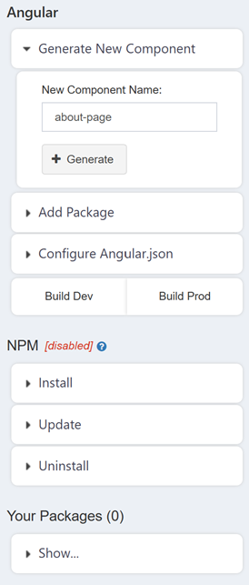

# Building a WebApp with Build Tools

The majority of use cases will find one of Composable's [WebApp templates](./04.WebApp-Templates.md) to be the quickest way to implement their desired solution in a WebApp. Users may opt to start a WebApp from the ground-up by creating a default WebApp with no template specified; but for building heavy-duty web applications, or for adapting an existing application that uses web application frameworks, Composable offers a suite of build tools.

!!! note
    At the moment, the Build Tools feature allows for building WebApps using [Angular's framework](https://angular.dev/), with support for more frameworks in development. Have a request for a specific framework, or a question about existing build tools? Let us know by [contacting us](https://composable.ai/contact-us) or sending an email to info@composable.ai.

To enable build tools when creating a WebApp, navigate to **Show Advanced Settings > Build Process** and select the process corresponding to your desired framework.

Once the WebApp is saved, you will notice two new sections of the [WebApp editor](./03-WebApp-Editor.md): the **Build Tools** toolbar, located on the right, and the **Build Console** tab at the bottom of the editor. Together, these additions provide an integrated development environment for your application; in the case of Angular, for example, the Build Tools provide the functionality of [Angular's CLI](https://angular.io/cli) in addition to support for NPM commands. This page will continue to use Angular as an example, although the specific commands shown may vary based on the web framework selected.

The Build Tools menu is divided into three sections, each containing several commands.

* **Angular**: This section contains framework-specific commands. For Angular, this includes generating new components, adding packages, and viewing and editing the project's `angular.json` specification. This section also contains commands to build for development and production.
* **NPM**: This section enables users to manage their package list via NPM by providing install, uninstall, and update commands. Note that the commands in this section require an active internet connection.
* **Your Packages**: This section works similarly to the [Project Structure](./03-WebApp-Editor.md#the-project-structure-panel) panel as a centralized location to view your list of installed packages for your WebApp.

Clicking on any command opens a tab containing options to customize the command - akin to adding flags to a traditional command-line command - and buttons to execute the command. Once a command is sent to execute, the **Build Console** displays the result of the command. For example, pressing '+ Generate' under the 'Generate New Component' command executes the command and displays the result in the Build Console.

